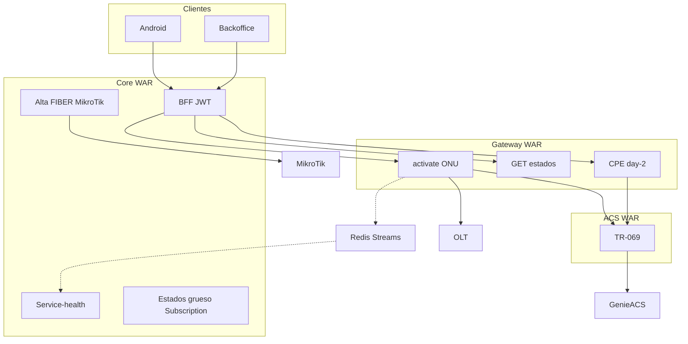

# Arquitectura 4 WARs — Core sin dominio ACS

Fecha: 2026-09-04.

El Core no orquesta TR-069 ni guarda identidad GenieACS. Gateway es la fachada técnica OLT+ACS. ACS WAR solo habla con Gateway y GenieACS.

## WARs

| WAR | Rol |
|-----|-----|
| Core | BFF JWT, alta FIBER (MikroTik + flags gruesos), 360 |
| OLT Gateway | Authorize ONU, estados por SN/`unique_external_id`, day-2 CPE, XADD `cpe.provisioning` |
| ACS | Proyección CPE (deviceId, cache WiFi/WAN), NBI GenieACS |
| Traffic | Contadores (sin cambio de frontera ACS) |

## Flags en Core

`subscription.oltProvisionStatus` y `subscription.tr069ProvisionStatus`: `PENDING` \| `COMPLETE` \| `FAILED` \| `NA`. Enganche: `fiberOnu.sn` / `fiberOnu.uniqueExternalId`.

## Alta parcial

`POST /subscription` no espera TR-069. Gateway `POST /onu/activate` autoriza OLT y responde `olt=COMPLETE`, `cpe=PENDING`. El cierre ACS llega por poll GET o Redis `cpe.provisioning`.

## Day-2

Clientes → Core JWT → Gateway (SN). Nunca Core → ACS WAR ni GenieACS.

Continua = HTTP. Punteada = Redis. ACS WAR solo con Gateway. Core no tiene entidades ni clientes ACS en runtime.

Detalle de transporte: [subsistemas-desacople-transporte.md](./subsistemas-desacople-transporte.md). Catálogo HTTP: [olt-gateway-comandos-catalogo.md](./olt-gateway-comandos-catalogo.md). Canvas: `arquitectura-4-wars-gateway-acs`.
