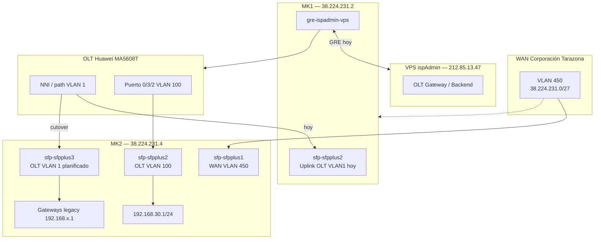
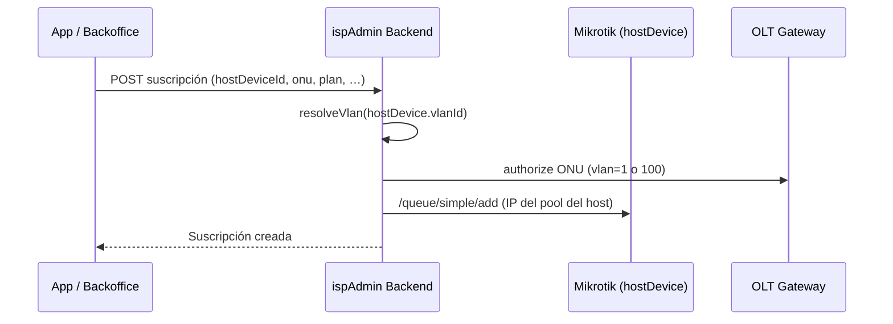

# Arquitectura de red dual Mikrotik (2 VLANs)

Documentación de la infraestructura de borde con **dos Cloud Core Router (CCR)** y segmentación por **VLAN de servicio GPON**. Evolución: MK2 absorberá **VLAN 100 y VLAN 1** en puertos SFP distintos para poder retirar MK1.

**Última actualización:** 2026-08-20

Checklist operativo VLAN 1 en MK2: [checklist-mk2-vlan1-sfp-sfpplus3.md](checklist-mk2-vlan1-sfp-sfpplus3.md)  
Runbook staging TR-069: [mk2-red-aprovisionamiento-255.md](mk2-red-aprovisionamiento-255.md)

---

## Resumen

| Elemento | MK1 (legacy, a retirar) | MK2 (destino) |
|----------|-------------------------|---------------|
| **ID en BD** (`network_device.id`) | `1` | `8` |
| **Nombre** | Mikrotik CCR / GIGAFIBER 1036 | Mikrotik CCR 2 / CCR2116 NUEVO |
| **IP pública** | `38.224.231.2` | `38.224.231.4` |
| **Modelo** | CCR1036 | CCR2116 |
| **RouterOS** | **7.23.2 (stable)** · build 2026-07-03 · RB **7.23.2** | **7.23.2 (stable)** · build 2026-07-03 · RB **7.19.6** (pend. **7.23.2**) |
| **Tipo ispAdmin** | `CLOUD_CORE_ROUTER` | `CLOUD_CORE_ROUTER` |
| **`vlan_id` en BD** | `1` | `100` (referencia; **alta usa `subscription.vlan` de la app**) |
| **VLAN OLT (servicio)** | `1` | `100` en `sfp-sfpplus2` + **`1` en `sfp-sfpplus3` (activo)** |
| **Uplink OLT** | `sfp-sfpplus2` (VLAN 1 legacy) | `sfp-sfpplus2` = VLAN 100; **`sfp-sfpplus3` = VLAN 1** |
| **WAN** | `sfp-sfpplus1` VLAN 450 | `sfp-sfpplus1` VLAN 450 (ya activo) |
| **Pool IP clientes** | `192.168.22/24`, `25/24`, `26/24`, `93/24`, … | VLAN100: `192.168.30.0/24` + `192.168.31.0/24`; VLAN1 legacy + **staging TR-069 `192.168.255.0/24` DHCP** |
| **Estado** | ~885 abonados activos | Dual uplink operativo + staging `.255/24` |

> **Importante:** la VLAN de autorización OLT y de GenieACS TR-069 sale de **`subscription.vlan` enviada por la app** (`"1"` o `"100"`). No hay fallback a `hostDevice.vlanId` ni a `genieacs.wan-vlan-id` en prod. Ver [mk2-red-aprovisionamiento-255.md](mk2-red-aprovisionamiento-255.md).

### RouterOS 7 en MK1 y MK2

Desde **2026-07-26** ambos cores ejecutan **RouterOS 7.23.2 (stable)**. MK1 migró desde **6.48.6 (long-term)**; MK2 ya estaba en v7.

Capacidades relevantes para operación y monitoreo (Netwatch HTTP/DNS, REST API, health/PSU, SNMP traps, WireGuard, colas CAKE/FQ_Codel, parches 7.23.2 incl. CVE-2026-59108 en PPP): ver **[routeros-7-gigafiber-cores.md](./routeros-7-gigafiber-cores.md)**.

Validaciones pendientes post-upgrade MK1: queues, deudores, GRE VPS, firewall CloudOLT.

---

## Diagrama de topología (objetivo MK2 dual uplink)



**Regla de amarre uplink ↔ VLAN (diseño actual):** cada enlace físico MK↔OLT termina una VLAN de servicio (nativa/untagged en ese puerto). No es que el cable “solo pueda” una VLAN, sino que así está configurado: VLAN 1 y VLAN 100 van por uplinks distintos.

---

## Roles de cada equipo

### MK1 — Router principal (producción, a retirar)

Concentra la mayoría de abonados VLAN 1 hasta el cutover a MK2 `sfp-sfpplus3`.

**Interfaces relevantes (RouterOS):**

| Interfaz | Función |
|----------|---------|
| `sfp-sfpplus1` + VLAN 450 | Uplink WAN hacia Corporación Tarazona. IP pública `38.224.231.2/27`. Default route `0.0.0.0/0 → 38.224.231.1`. |
| `sfp-sfpplus2` | Salida 10G hacia OLT (tráfico GPON VLAN 1). Miembro del bridge `LAN` con PVID 1. |
| Bridge `LAN` | Agrega OLT, switch sectores (`ether5`, `ether6`), AirFiber (`ether7`), PPPoE inalámbrico. Gateways de clientes (`192.168.22.1`, `192.168.25.1`, `192.168.26.1`, …). |
| `ether3` | Administración OLT directa `10.11.104.88/24` (sin VLAN). |
| `gre-ispadmin-vps` | Túnel al VPS para acceso remoto a la OLT vía OLT Gateway. |

**VLANs en MK1:**

| VLAN ID | Interfaz lógica | Uso |
|---------|-----------------|-----|
| **450** | `SERVICIO CORP.TARAZONA` | WAN / salida a internet |
| **1** | bridge `LAN` (PVID 1) | Servicio GPON legacy |

MK1 **no** tiene VLAN 100.

### MK2 — Router destino (VLAN 100 + VLAN 1)

| Puerto | Rol | Estado |
|--------|-----|--------|
| `sfp-sfpplus1` | WAN Corp Tarazona (`38.224.231.4/27`, GW `38.224.231.1`) | Activo |
| `sfp-sfpplus2` | OLT piloto VLAN **100** untagged — gateway `192.168.30.1/24` | Activo |
| `sfp-sfpplus3` | OLT VLAN **1** — puerto en bridge `LAN_MK1` (26 gateways + PPPoE + firewall) | Activo; sin `/interface vlan` (VLAN1 = bridge) |
| `sfp-sfpplus4` | Libre / reserva | — |

Abonados VLAN100: pools `192.168.30.0/24` y `192.168.31.0/24` (piloto migrado ej. suscripción 629 → `192.168.30.36`). Ver `mk2-pool-31-prod-2026-09-05.md`.  
Abonados VLAN1: tras cutover, mismos gateways/pools que hoy están en MK1, terminados en MK2.

---

## VPS y acceso a la OLT

El backend en el VPS (`212.85.13.47`) no alcanza la red de gestión OLT (`10.11.104.0/24`) directamente. El acceso se hace vía **túnel GRE** desde MK1:

```
VPS (10.255.255.2) ←GRE→ MK1 (10.255.255.1) → 10.11.104.0/24 (OLT mgmt)
```

- Interfaz GRE en MK1: `gre-ispadmin-vps`
- Antes de apagar MK1 hay que **recrear GRE (o equivalente) en MK2**
- Los flaps del GRE no cortan internet de clientes GPON, pero afectan operaciones remotas

---

## Integración con ispAdmin

### Tabla `network_device`

Campos clave para la arquitectura dual:

| Campo | Descripción |
|-------|-------------|
| `network_device_type` | `CLOUD_CORE_ROUTER` para MK1/MK2 |
| `ip_address` | IP de gestión/API del router |
| `username` / `password` | Credenciales API RouterOS |
| `vlan_id` | VLAN de servicio OLT asociada (`1` o `100`) |
| `disabled` | Si `true`, no aparece en `GET /networkDevice/coreTypes` |

Consulta de referencia:

```sql
SELECT id, name, ip_address, network_device_type, vlan_id, disabled
FROM network_device
WHERE network_device_type = 'CLOUD_CORE_ROUTER'
ORDER BY id;
```

### Suscripción → `host_device_id`

Cada abonado activo apunta al Mikrotik que gestiona su tráfico:

| Operación | Mikrotik usado |
|-----------|----------------|
| Cola simple (`/queue/simple`) | `subscription.host_device_id` |
| Corte / reactivación (lista `deudores`) | Agrupado por `hostDevice` |
| Autorización ONU en OLT | VLAN derivada de `hostDevice.vlanId` |

Distribución esperada en producción:

```sql
SELECT hd.id, hd.name, hd.vlan_id, COUNT(*) AS activos
FROM subscription s
JOIN network_device hd ON s.host_device_id = hd.id
WHERE s.service_status <> 'CANCELLED'
GROUP BY hd.id, hd.name, hd.vlan_id
ORDER BY activos DESC;
```

### Resolución de VLAN en instalaciones de fibra

Clase: `FiberInstallationStrategy` (`resolveVlan`).

```
hostDevice.vlanId → string enviado a OLT en OnuAuthorizationRequest.vlan
```

Reglas:

1. `hostDevice` obligatorio y no deshabilitado.
2. Si es `CLOUD_CORE_ROUTER`, **`vlan_id` no puede ser NULL**.
3. MK1 → `"1"`, MK2 → `"100"`.
4. Fallback `"1"` solo para tipos que no son Cloud Core.

Pruebas: `FiberInstallationStrategyTest`, `NetworkDeviceVlanTest`.

### Pools de IP (`ip_pool`)

Cada segmento IP está ligado a un `hostDevice`. Al registrar un abonado, el pool debe corresponder al Mikrotik elegido:

| Mikrotik / VLAN | Segmentos típicos |
|-----------------|-------------------|
| MK1 / VLAN 1 (hoy) | `192.168.22.0/24`, `192.168.25.0/24`, `192.168.26.0/24`, `192.168.93.0/24`, … |
| MK2 / VLAN 100 | `192.168.30.0/24`, `192.168.31.0/24` |
| MK2 / VLAN 1 (tras cutover) | Mismos pools legacy con `host_device_id=8` |

### API expuesta

| Endpoint | Uso |
|----------|-----|
| `GET /networkDevice/coreTypes` | Lista CCR activos para selector en app/backoffice |
| `GET /networkDevice/connection/cloud-core-routers` | Misma lista para conexiones |

### App Android

- Si hay **más de un** CCR activo, el formulario de alta muestra selector de dispositivo host.
- Validación: `subscriptionHostDeviceError` exige host entre cores activos.
- Auto-selección si solo hay un core activo.

---

## Flujo de alta de abonado fibra (dual core)



Checklist operativo:

1. Elegir **hostDevice** correcto (MK1 legacy vs MK2 piloto).
2. Verificar que el **pool IP** pertenezca al mismo host.
3. Confirmar puerto OLT / NAP alineado con la VLAN del host.
4. Tras autorizar, validar queue en el Mikrotik correspondiente.

---

## Migración MK1 → MK2

Estado actual (referencia producción, jul 2026):

| Fase | Descripción |
|------|-------------|
| **Hecho** | MK2 operativo: WAN + VLAN 100 en `sfp-sfpplus2`, registro BD id=8 |
| **Hecho** | GRE VPS ↔ MK1 para gestión OLT remota |
| **Hecho** | Piloto ONU→VLAN100 (ej. sub 629 → `192.168.30.36`) |
| **En curso** | VLAN 1 en MK2: `vlan1-olt` + 26 gateways + firewall; falta fibra + cutover MK1 |
| **Prep PPPoE** | MK2: pools/profiles/123 secrets; server **enabled** en `LAN_MK1`. Cutover físico: mover AirFiber — [cutover-pppoe-wireless-mk2.md](cutover-pppoe-wireless-mk2.md) |
| **Prep SmartOLT** | MK2: CloudOLT DNAT en `.4` + `10.11.104.89` en `ether3` — [smartolt-cloudolt-mk2.md](smartolt-cloudolt-mk2.md). Panel SmartOLT aún puede apuntar a `.2` |
| **Hecho** | MK2 API/SSH/Winbox: allowlist `212.85.13.47` + `192.168.0.0/16`; drop resto — [mk2-api-allowlist.md](mk2-api-allowlist.md) |
| **Pendiente** | Apagado MK1 tras validación |

### Dos caminos (conviven)

| Camino | Qué implica | ONU |
|--------|-------------|-----|
| **A. Cutover VLAN 1** | Mover uplink VLAN1 a MK2 `sfp-sfpplus3`, copiar gateways/colas | Sin cambio de VLAN/IP |
| **B. Migración VLAN 100** | SmartOLT `update_main_vlan` + WAN ONU VLAN100 + IP `192.168.30.x` | Cambio por cliente |

Checklist detallado camino A: [checklist-mk2-vlan1-sfp-sfpplus3.md](checklist-mk2-vlan1-sfp-sfpplus3.md)  
Piloto camino B: [migracion-piloto-vsolva74-629.md](migracion-piloto-vsolva74-629.md)

### Cutover VLAN 1 (resumen)

1. Preparar bridge/`sfp-sfpplus3` en MK2 **sin** IPs duplicadas mientras MK1 sigue en el L2.
2. En ventana: bajar gateways en MK1 → conectar uplink a MK2 `sfp-sfpplus3` → subir gateways en MK2.
3. Migrar colas / deudores / PPPoE; validar ARP + internet.
4. Reconciliar BD (`host_device_id=8`, `ip_pool`).
5. Migrar GRE; desconectar MK1.

---

## Diagnóstico rápido

### Verificar salud hardware

```bash
/system health print
```

En MK1, revisar `psu1-state` y `psu2-state` (jul 2026: PSU1 en fallo reportado).

### VLANs en MK1

```bash
/interface vlan print detail
/ip address print where interface~"vlan|SERVICIO|LAN"
```

### Conteo de abonados por core (BD)

Ver consulta SQL en sección *Suscripción → host_device_id*.

### Síntomas frecuentes post-migración

| Síntoma | Causa probable |
|---------|----------------|
| ONU online en OLT pero sin internet | VLAN incorrecta en service-port vs `hostDevice.vlanId` |
| Queue no limita | Cola creada en MK1 pero abonado en MK2 (o viceversa) |
| Corte no aplica | IP en lista `deudores` del Mikrotik equivocado |
| OLT Gateway timeout | GRE inestable o firewall input GRE en MK1 |

---

## Referencias en código

| Archivo | Contenido |
|---------|-----------|
| `data/model/NetworkDevice.kt` | Entidad con `vlanId`, tipos `CLOUD_CORE_ROUTER` |
| `service/subscription/strategies/FiberInstallationStrategy.kt` | `resolveVlan`, autorización ONU |
| `service/mikrotik/AddressListManagerService.kt` | Cortes agrupados por `hostDevice` |
| `service/mikrotik/QueueManagerService.kt` | Colas por `hostDevice` |
| `repository/NetworkDeviceRepository.kt` | `findActiveCloudCoreRouters()` |
| `controller/NetworkDeviceController.kt` | `GET /networkDevice/coreTypes` |
| `FiberInstallationStrategyTest.kt` | Contrato VLAN 1 / 100 |
| `NetworkDeviceVlanTest.kt` | Contrato DTO y request con `vlanId` |
| `MIKROTIK_MOCK_README.md` | Modos mock/real para desarrollo |

---

## Notas de entorno

| Entorno | Observación |
|---------|-------------|
| **Producción** | `vlan_id` debe estar poblado (1 y 100). Credenciales en `network_device`. |
| **Dev local (`ispadmin_dev`)** | Puede tener `vlan_id` NULL; configurar antes de probar altas dual-core. |
| **Dispositivo test** | `mikrotik_test` (id=7, `192.168.1.100`) — solo desarrollo, deshabilitado en prod. |
