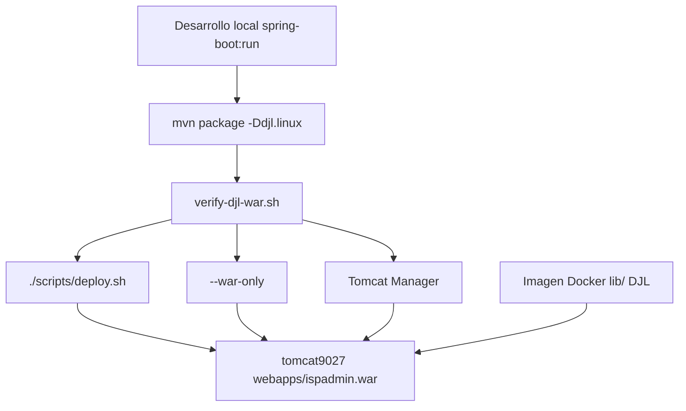

# Flujo de deploy — ispadmin-backend (Tomcat Docker)

Guía operativa para desplegar el backend en producción con **DJL/PyTorch** en el VPS.

Build verificado: `bash mvnw clean package -DskipTests -Ddjl.linux` + `./scripts/deploy.sh --full` (2026-06-17).

---

## Resumen

| Escenario | Comando |
|-----------|---------|
| **Setup único** (DJL en imagen Docker) | `./scripts/deploy.sh --setup` |
| **Setup + primer WAR** | `./scripts/deploy.sh --full` |
| **Release habitual** | `./scripts/deploy.sh` |
| **Solo subir WAR ya compilado** | `./scripts/deploy.sh --war-only` |

En el día a día solo necesitas **`./scripts/deploy.sh`** o **`--war-only`**.

---

## Infraestructura de producción

| Item | Valor |
|------|-------|
| Host | `212.85.13.47` (Ubuntu `srv1043610`) |
| Docker Compose | `/opt/gigafiber/docker-compose.yml` |
| Contenedor Tomcat | `tomcat9027` |
| Imagen | `gigafiber/tomcat:9.0.27-custom` |
| Base Docker | `tomcat:9.0-jdk11-temurin-jammy` |
| JARs DJL (host) | `/opt/gigafiber/tomcat/lib/*.jar` |
| WAR en contenedor | `/usr/local/tomcat/webapps/ispadmin.war` |
| Context path | `/ispadmin` |
| Env secrets | `/opt/gigafiber/.env` vía `tomcat.env_file` en compose |
| Tomcat Manager | `http://212.85.13.47:8080/manager` |

Los JARs de PyTorch/DJL **no van dentro del WAR**. Se embeben en la imagen Docker vía `COPY lib/*.jar` en el Dockerfile.

El servicio `tomcat` debe tener:

```yaml
env_file:
  - /opt/gigafiber/.env
```

Sin eso, Spring no recibe `OBS_API_KEY_*`, WhatsApp, `OBS_SESSION_SECRET`, `MEILI_MASTER_KEY`, etc. (`application-prod.properties` usa `${OBS_API_KEY_DASHBOARD:}` y similares). El script `./scripts/deploy.sh --setup|--full` asegura el `env_file` en compose.

**Importante:** recrear el contenedor Tomcat borra el WAR (no está en volumen). Tras `docker compose up -d tomcat` hay que volver a `./scripts/deploy.sh --war-only`.

`WEB-INF/` ya no se versiona en el repo. La única fuente de verdad para properties del backend es `src/main/resources/application*.properties`; las variables ya externalizadas siguen llegando desde `/opt/gigafiber/.env`.

También se necesita `SPRING_DATASOURCE_URL=jdbc:mysql://mysql:3306/ispadmin?...` en `environment` (no `127.0.0.1`: dentro del contenedor MySQL no escucha en localhost).

`MEILI_HOST=http://meilisearch:7700` debe estar en `.env` (mismo motivo).

---

## Configuración local (una vez por máquina)

```bash
cd ispadmin-backend
cp scripts/deploy.config.example scripts/deploy.config.local
```

Edita `scripts/deploy.config.local` con el host y, si aplica, la ruta de tu clave SSH:

```bash
VPS_HOST=212.85.13.47
SSH_IDENTITY_FILE=~/.ssh/id_rsa
```

`scripts/deploy.config.local` está en `.gitignore`. **No guardar passwords en ese archivo.**

Acceso recomendado por clave SSH:

```bash
ssh-copy-id root@212.85.13.47
```

Si aún no hay clave, el script **pide la contraseña una sola vez** al inicio (sesión SSH compartida). También puedes exportarla antes:

```bash
export DEPLOY_SSH_PASSWORD='...'
./scripts/deploy.sh
```

---

## Regla de compilación (obligatoria)

Antes de compilar, deben existir ambos modelos en el repo:

- `src/main/resources/models/face_feature.zip` (~100 MB)
- `src/main/resources/models/ultranet.zip`

Si falta `face_feature.zip`, restaurarlo desde git:

```bash
git checkout a4c8d3c -- src/main/resources/models/face_feature.zip
```

Desde Mac, **siempre** compilar para Linux x86_64:

```bash
bash mvnw clean package -DskipTests -Ddjl.linux
bash scripts/verify-djl-war.sh
```

| Perfil | Cuándo |
|--------|--------|
| `-Ddjl.linux` | Mac → servidor x86_64 (producción actual) |
| `-Ddjl.linux.aarch64` | Mac → servidor ARM64 |
| (sin flag) | Desarrollo local en Mac |

El script `verify-djl-war.sh` confirma:

- El WAR **no** contiene JARs DJL/PyTorch.
- `target/tomcat-lib/` contiene `pytorch-native-cpu-*-linux-x86_64.jar` e `ispadmin-djl-native-helper.jar`.

---

## Flujo 1 — Setup único (DJL en Docker)

Ejecutar **una sola vez**, o de nuevo solo si:

- Cambias versión de DJL/PyTorch.
- Reconstruyes la imagen Tomcat desde cero.
- Borras `/opt/gigafiber/tomcat/lib/` en el VPS.

```bash
./scripts/deploy.sh --full
```

Qué hace `--full`:

1. Compila WAR con `-Ddjl.linux`.
2. Ejecuta `verify-djl-war.sh`.
3. Sube `target/tomcat-lib/*.jar` → `/opt/gigafiber/tomcat/lib/`.
4. Sube `scripts/docker/tomcat.Dockerfile` → `/opt/gigafiber/tomcat/Dockerfile`.
5. Añade `CATALINA_OPTS` en `docker-compose.yml` (si no existe).
6. `docker compose build tomcat && docker compose up -d tomcat`.
7. Despliega `target/ispadmin.war` al contenedor.
8. Espera `/ispadmin/` y valida logs DJL.

Si el setup DJL ya está hecho y solo quieres subir el WAR tras rebuild:

```bash
./scripts/deploy.sh --setup    # solo DJL + imagen
./scripts/deploy.sh --war-only # WAR después del rebuild
```

---

## Flujo 2 — Release habitual (cada versión)

### Opción A — Script (recomendada)

```bash
./scripts/deploy.sh
```

Equivale a `--deploy` (modo por defecto):

1. `mvnw clean package -DskipTests -Ddjl.linux`
2. `verify-djl-war.sh`
3. SCP del WAR al VPS
4. `docker cp` a `tomcat9027:/usr/local/tomcat/webapps/ispadmin.war`
5. Espera despliegue de Spring Boot (~30–60 s)
6. Comprueba `GET /ispadmin/` → HTTP 200

Si **ya compilaste** y no quieres rebuild:

```bash
./scripts/deploy.sh --war-only
```

### Opción B — Tomcat Manager (manual)

1. Compilar en Mac:
   ```bash
   bash mvnw clean package -DskipTests -Ddjl.linux
   bash scripts/verify-djl-war.sh
   ```
2. Abrir `http://212.85.13.47:8080/manager`.
3. Subir `target/ispadmin.war`.

No tocar `lib/` ni Dockerfile: DJL ya está en la imagen.

---

## Validación post-deploy

```bash
# App levantada
curl -s -o /dev/null -w "%{http_code}\n" http://212.85.13.47:8080/ispadmin/
# Esperado: 200

# Logs DJL en el VPS
ssh root@212.85.13.47 'docker logs tomcat9027 2>&1 | grep "Motor facial DJL listo"'
# Esperado: Motor facial DJL listo para generar descriptores.

# Endpoint facial (multipart; 200 sin error PyTorch)
curl -s -o /dev/null -w "%{http_code}\n" \
  -X POST http://212.85.13.47:8080/ispadmin/api/face-data/photo/check \
  -F "photo=@ruta/foto.jpg"

# Observabilidad: API keys cargadas (registro de release)
curl -s -o /dev/null -w "%{http_code}\n" \
  -X POST https://api.gigafiberperu.cloud/ispadmin/observability/releases \
  -H "X-Obs-Api-Key: $OBS_API_KEY" \
  -H 'Content-Type: application/json' \
  -d '{"platform":"backend","release":"check","semver":"0.0.0","gitSha":"deadbee","notes":null}'
# Esperado: 201 (o 4xx de validación de negocio, nunca 401 por API key)
```

Spring Boot tarda en arrancar tras copiar el WAR. Si ves 404 al instante, espera ~1 minuto y reintenta.

Si el registro de release del deploy imprime `Missing or invalid X-Obs-Api-Key`, el contenedor no tiene `env_file` apuntando a `/opt/gigafiber/.env`.

---

## Diagrama del flujo



---

## Archivos del repo

| Archivo | Rol |
|---------|-----|
| `scripts/deploy.sh` | Automatización deploy |
| `scripts/deploy.config.example` | Plantilla de config VPS |
| `scripts/deploy.config.local` | Config local (gitignored) |
| `scripts/verify-djl-war.sh` | Valida WAR sin DJL + tomcat-lib Linux |
| `scripts/docker/tomcat.Dockerfile` | Dockerfile subido al VPS en `--setup` |
| `target/ispadmin.war` | Artefacto a desplegar |
| `target/tomcat-lib/*.jar` | JARs para imagen Docker (solo en setup) |

---

## Errores frecuentes

| Síntoma | Causa | Solución |
|---------|-------|----------|
| `Failed to load PyTorch native library` | WAR compilado sin `-Ddjl.linux` o DJL no en imagen | Rebuild con `-Ddjl.linux`; ejecutar `--setup` o `--full` |
| `zip END header not found` al desplegar | WAR corrupto o copia incompleta | `./scripts/deploy.sh --war-only` (el script valida tamaño) |
| `GET /ispadmin/` → 404 justo después del deploy | Spring Boot aún arrancando | Esperar ~1 min; el script ya usa `wait_for_app` |
| DJL OK en local, falla en prod | JARs macOS en WAR o GLIBC antiguo | Usar `-Ddjl.linux` + imagen `temurin-jammy` |

---

## Seguridad

- Usar clave SSH; rotar password si se expuso en chat o logs.
- No commitear `deploy.config.local` ni passwords.
- `DEPLOY_SSH_PASSWORD` solo como variable de entorno temporal.

---

## Referencias

- Modelos faciales en WAR: `.agent-docs/djl-models-in-war.md`
- Instalación DJL en Tomcat bare metal (no Docker): `scripts/install-djl-tomcat-libs.sh`
