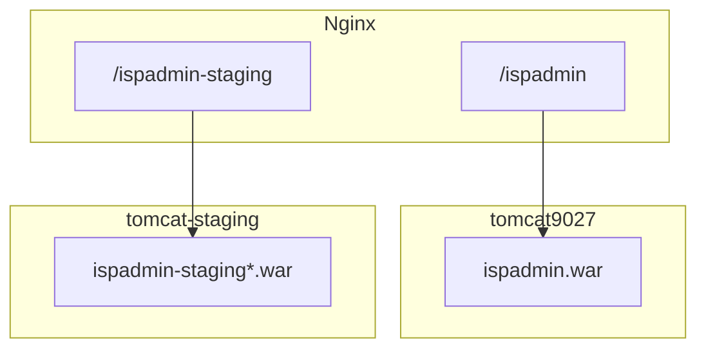

# Flujo de deploy — ispadmin-backend (Tomcat Docker)

Guía operativa para desplegar el backend en producción con **DJL/PyTorch** en el VPS.

Build verificado: `bash mvnw clean package -DskipTests -Ddjl.linux` + `./scripts/deploy.sh --full` (2026-06-17).

Último deploy prod: hotfix `hotfix/search-debt-hydrate` @ `83de8fe` → `APP_RELEASE=1.0.3+83de8fe` (deuda/facturas pendientes en `GET /subscription/search`). Detalle: [hotfix-search-debt-hydrate-2026-09-03.md](./hotfix-search-debt-hydrate-2026-09-03.md). Base prod previa: `4c1cc1f`.

Restore 2026-09-03 14:58: el recreate de Tomcat por staging dejó `/ispadmin` en 404 (el WAR de prod no volvió a webapps). Se reinstaló el mismo artefacto `/opt/gigafiber/ispadmin.war` (`1.0.3+83de8fe`, 00:33). Health público 200. Mitigación actual: Tomcat staging propio (`tomcat-staging` :8081) — [staging-tomcat-isolation-war-selectivo.md](./staging-tomcat-isolation-war-selectivo.md). Detalle del incidente: [restore-prod-war-staging-recreate-2026-09-03.md](./restore-prod-war-staging-recreate-2026-09-03.md).

Deploy anterior: hotfix `hotfix/migration-vlan-from-app` @ `438ce45` (VLAN en migración wireless→fibra). Detalle: [hotfix-migration-vlan-2026-09-02.md](./hotfix-migration-vlan-2026-09-02.md). Base prod previa: `dfd2e4c` (`APP_RELEASE=1.0.3+dfd2e4c`).

Deploy anterior documentado: `./scripts/deploy.sh --env prod` desde `develop` @ `41ecc90` → release `1.0.3+41ecc90` (2026-09-01). Detalle: [deploy-prod-2026-09-01.md](./deploy-prod-2026-09-01.md).

Deploy anterior: `./scripts/deploy.sh --deploy` desde `develop` @ `7f7f9af` → release `1.0.3+7f7f9af` (2026-08-31, Wi-Fi ACS por `observed_at` / V36). Detalle: [deploy-prod-wifi-observed-at-2026-08-31.md](./deploy-prod-wifi-observed-at-2026-08-31.md).

Fix CORS 401 (`CorsFilter` antes de `PlatformAuthFilter`): [fix-cors-401-platform-auth-2026-07-23.md](./fix-cors-401-platform-auth-2026-07-23.md) — **desplegado** en prod (`1.0.3+32a68e4`); GET 401 con Origin backoffice ya incluye `Access-Control-Allow-Origin`.

---

Último deploy staging: `./scripts/deploy.sh --env staging --with servicehealth,oltgateway,netdiag,traffic` → `1.0.3+49c036a` (hora local en series Wi‑Fi `formatApi` + fixes telemetría). Detalle backoffice: `ispadmin-backoffice/.agent-docs/service-health-hora-local-2026-08-31.md`. Deploy óptica SSH lab previo: [deploy-staging-lab-optical-ssh-2026-08-31.md](./deploy-staging-lab-optical-ssh-2026-08-31.md). Staging split ahora también construye `ispadmin-staging-acs.war` (ACS WAR; solo Gateway lo llama).

## Resumen

| Escenario | Comando |
|-----------|---------|
| **Setup único** (DJL en imagen Docker) | `./scripts/deploy.sh --setup` |
| **Setup + primer WAR** | `./scripts/deploy.sh --full` |
| **Release habitual (prod)** | `./scripts/deploy.sh --env prod` |
| **Pre-prod (Tomcat propio `tomcat-staging` :8081)** | `./scripts/deploy.sh --env staging` |
| **Staging un WAR** | `./scripts/deploy.sh --env staging --only oltgateway` |
| **Solo subir WAR ya compilado** | `./scripts/deploy.sh --war-only --env prod\|staging` |

En el día a día solo necesitas **`./scripts/deploy.sh`** o **`--war-only`**.

Todos los modos que despliegan un WAR (`--deploy`, `--full` y `--war-only`) ejecutan primero `mvnw clean test`. Con `set -e`, cualquier test fallido cancela el proceso antes de compilar el WAR, abrir SSH o modificar el VPS. `--war-only` reutiliza el artefacto, pero no omite esta compuerta.

---

## Infraestructura de producción

| Item | Valor |
|------|-------|
| Host | `212.85.13.47` (Ubuntu `srv1043610`) |
| Docker Compose | `/opt/gigafiber/docker-compose.yml` |
| Contenedor Tomcat prod | `tomcat9027` (host **8080**) |
| Contenedor Tomcat staging | `tomcat-staging` (host **8081** → 8080 interno) |
| Imagen | `gigafiber/tomcat:9.0.27-custom` (DJL en `/opt/gigafiber/tomcat/lib`) |
| Base Docker | `tomcat:9.0-jdk11-temurin-jammy` |
| JARs DJL (host) | `/opt/gigafiber/tomcat/lib/*.jar` |
| WAR prod | `tomcat9027` `/usr/local/tomcat/webapps/ispadmin.war` → `/ispadmin` → MySQL `ispadmin` |
| WAR staging | `tomcat-staging` `ispadmin-staging*.war` → `/ispadmin-staging*` → `ispadmin_staging` / `stg_*` |
| Tomcat Manager prod | `http://212.85.13.47:8080/manager` |

Los JARs de PyTorch/DJL **no van dentro del WAR**. Se embeben en la imagen Docker vía `COPY lib/*.jar` en el Dockerfile.

Staging y prod **no comparten JVM**. Detalle: [staging-tomcat-isolation-war-selectivo.md](./staging-tomcat-isolation-war-selectivo.md). `--env staging` no recrea `tomcat9027` ni toca `ispadmin.war`. Nginx `/ispadmin-staging*` → `gigafiber_backend_staging` → `127.0.0.1:8081`. URLs públicas no cambian.

### `--only` (staging)

`--only` gana siempre. Sin flag: `git diff --name-only HEAD`. Árbol limpio o solo docs → hay que pasar `--only`.

| Rutas | WAR |
|-------|-----|
| `**/oltgateway/**`, `application-oltgateway.properties` | Gateway |
| `**/acs/**`, `application-acs.properties` | ACS |
| `**/traffic/**`, `application-traffic.properties` | Traffic |
| `**/wispadmin/**`, observability/netdiag/servicehealth, `application-staging.properties` | Core |
| `**/events/**`, `pom.xml`, `application-prod.properties`, `application.properties` | los 4 |

`--with` solo activa clientes HTTP al empaquetar Core; no elige qué WAR se construye. `rsync -t` una vez; `deploy_*` hace `docker cp` desde el host.

---

## Configuración local (una vez por máquina)

```bash
cd ispadmin-backend
cp scripts/deploy.config.example scripts/deploy.config.local
```

Edita `scripts/deploy.config.local` con el host y, si aplica, la ruta de tu clave SSH:

```bash
VPS_HOST=212.85.13.47
SSH_IDENTITY_FILE=~/.ssh/id_rsa
```

`scripts/deploy.config.local` está en `.gitignore`. **No guardar passwords en ese archivo.**

Secretos en el servidor (`.env`, Docker Compose, frontends): [vps-secrets-management.md](./vps-secrets-management.md).

Acceso recomendado por clave SSH:

```bash
ssh-copy-id root@212.85.13.47
```

Si aún no hay clave, el script **pide la contraseña una sola vez** al inicio (sesión SSH compartida). También puedes exportarla antes:

```bash
export DEPLOY_SSH_PASSWORD='...'
./scripts/deploy.sh
```

---

## Regla de compilación (obligatoria)

Antes de compilar, deben existir los modelos en el repo (dev/classpath y rsync a VPS):

- `src/main/resources/models/face_feature.zip` (~99 MB)
- `src/main/resources/models/ultranet.zip`
- `src/main/resources/models/arcface_w600k_mbf.onnx`

Si falta `face_feature.zip`, restaurarlo desde git:

```bash
git checkout a4c8d3c -- src/main/resources/models/face_feature.zip
```

Desde Mac, **siempre** compilar para Linux x86_64:

```bash
bash mvnw clean package -DskipTests -Ddjl.linux
bash scripts/verify-djl-war.sh
```

| Perfil | Cuándo |
|--------|--------|
| `-Ddjl.linux` | Mac → servidor x86_64 (producción actual) |
| `-Ddjl.linux.aarch64` | Mac → servidor ARM64 |
| (sin flag) | Desarrollo local en Mac |

El script `verify-djl-war.sh` confirma:

- El WAR **no** contiene JARs DJL/PyTorch.
- El WAR **no** contiene `WEB-INF/classes/models/` (van a `/opt/gigafiber/models/` vía rsync).
- `target/tomcat-lib/` contiene `pytorch-native-cpu-*-linux-x86_64.jar` e `ispadmin-djl-native-helper.jar`.

---

## Flujo 1 — Setup único (DJL en Docker)

Ejecutar **una sola vez**, o de nuevo solo si:

- Cambias versión de DJL/PyTorch.
- Reconstruyes la imagen Tomcat desde cero.
- Borras `/opt/gigafiber/tomcat/lib/` en el VPS.

```bash
./scripts/deploy.sh --full
```

Qué hace `--full`:

1. Compila WAR con `-Ddjl.linux`.
2. Ejecuta `verify-djl-war.sh`.
3. Sube `target/tomcat-lib/*.jar` → `/opt/gigafiber/tomcat/lib/`.
4. Rsync `src/main/resources/models/` → `/opt/gigafiber/models/` y volumen Tomcat `:ro`.
5. Sube `scripts/docker/tomcat.Dockerfile` → `/opt/gigafiber/tomcat/Dockerfile`.
6. Añade `CATALINA_OPTS` en `docker-compose.yml` (si no existe).
7. `docker compose build tomcat && docker compose up -d tomcat`.
8. Despliega `target/ispadmin.war` al contenedor.
9. Espera `/ispadmin/` y valida logs DJL.

Si el setup DJL ya está hecho y solo quieres subir el WAR tras rebuild:

```bash
./scripts/deploy.sh --setup    # solo DJL + imagen
./scripts/deploy.sh --war-only # WAR después del rebuild
```

---

## Flujo 2 — Release habitual (cada versión)

### Opción A — Script (recomendada)

```bash
./scripts/deploy.sh
```

Equivale a `--deploy` (modo por defecto):

1. `mvnw clean test` y cancelación inmediata ante cualquier fallo
2. `mvnw clean package -DskipTests -Ddjl.linux`
3. `verify-djl-war.sh`
4. SCP del WAR al VPS
5. `docker cp` a `tomcat9027:/usr/local/tomcat/webapps/ispadmin.war`
6. Espera despliegue de Spring Boot (~30–60 s)
7. Comprueba `GET /ispadmin/` → HTTP 200

Si **ya compilaste** y no quieres rebuild:

```bash
./scripts/deploy.sh --war-only
```

### Opción B — Tomcat Manager (manual)

1. Compilar en Mac:
   ```bash
   bash mvnw clean package -DskipTests -Ddjl.linux
   bash scripts/verify-djl-war.sh
   ```
2. Abrir `http://212.85.13.47:8080/manager`.
3. Subir `target/ispadmin.war`.

No tocar `lib/` ni Dockerfile: DJL ya está en la imagen.

---

## Validación post-deploy

```bash
# App levantada
curl -s -o /dev/null -w "%{http_code}\n" http://212.85.13.47:8080/ispadmin/
# Esperado: 200

# Logs DJL en el VPS
ssh root@212.85.13.47 'docker logs tomcat9027 2>&1 | grep "Motor facial DJL listo"'
# Esperado: Motor facial DJL listo para generar descriptores.

# Endpoint facial (multipart; 200 sin error PyTorch)
curl -s -o /dev/null -w "%{http_code}\n" \
  -X POST http://212.85.13.47:8080/ispadmin/api/face-data/photo/check \
  -F "photo=@ruta/foto.jpg"
```

Spring Boot tarda en arrancar tras copiar el WAR. Si ves 404 al instante, espera ~1 minuto y reintenta.

---

## Diagrama del flujo



---

## Archivos del repo

| Archivo | Rol |
|---------|-----|
| `scripts/deploy.sh` | Automatización deploy |
| `scripts/deploy-select-wars.sh` | Set de WAR staging (`--only` o git) |
| `scripts/ensure-tomcat-staging-compose.py` | Alta idempotente de `tomcat-staging` |
| `scripts/rewrite-nginx-staging-upstream.py` | Upstream staging :8081 |
| `scripts/deploy.config.example` | Plantilla de config VPS |
| `scripts/deploy.config.local` | Config local (gitignored) |
| `scripts/verify-djl-war.sh` | Valida WAR sin DJL + tomcat-lib Linux |
| `scripts/docker/tomcat.Dockerfile` | Dockerfile subido al VPS en `--setup` |
| `target/ispadmin.war` | Artefacto a desplegar |
| `target/tomcat-lib/*.jar` | JARs para imagen Docker (solo en setup) |

---

## Errores frecuentes

| Síntoma | Causa | Solución |
|---------|-------|----------|
| `Failed to load PyTorch native library` | WAR compilado sin `-Ddjl.linux` o DJL no en imagen | Rebuild con `-Ddjl.linux`; ejecutar `--setup` o `--full` |
| `zip END header not found` al desplegar | WAR corrupto o copia incompleta | `./scripts/deploy.sh --war-only` (el script valida tamaño) |
| `GET /ispadmin/` → 404 justo después del deploy | Spring Boot aún arrancando | Esperar ~1 min; el script ya usa `wait_for_app` |
| DJL OK en local, falla en prod | JARs macOS en WAR o GLIBC antiguo | Usar `-Ddjl.linux` + imagen `temurin-jammy` |

---

## Seguridad

- Usar clave SSH; rotar password si se expuso en chat o logs.
- No commitear `deploy.config.local` ni passwords.
- `DEPLOY_SSH_PASSWORD` solo como variable de entorno temporal.

---

## Referencias

- Modelos faciales en disco (no en el WAR): `.agent-docs/wars-adelgazados-models-fs.md`
- Modelos faciales (histórico classpath en WAR): `.agent-docs/djl-models-in-war.md`
- Instalación DJL en Tomcat bare metal (no Docker): `scripts/install-djl-tomcat-libs.sh`
