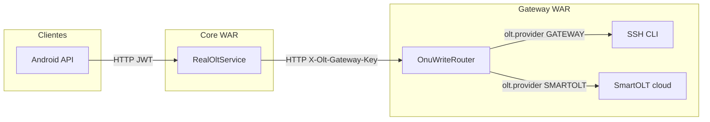

# Toggle SmartOLT / SSH de escrituras en Gateway (2026-09-05)

El interruptor `olt.provider.authorize|delete|reboot|move` (`SMARTOLT` \| `GATEWAY`) vive en el WAR Gateway. Core, con `olt.gateway.client-enabled=true`, habla solo con Gateway (compat HTTP). Default: `GATEWAY` (SSH).

## Flujo



Lecturas (`unconfigured_onus`, `by-sn`) siguen SSH/SNMP/autofind local. Tras authorize/delete/move por cloud se persiste `olt_mgr_onu`.

## Keys

Ver [vps-secrets-management.md](./vps-secrets-management.md): `OLT_SERVICE_*`, `OLT_PROVIDER_*`. Overlay: `application-oltgateway.properties`.

## Verificación

```bash
./mvnw -Dtest=OnuWriteRouterTest,OnuWriteProviderPropertiesDefaultsTest,RealOltServiceTest,SatelliteBoundaryTest,RestSmartOltWriteClientTest,OltManagerFacadeTest test
```
