# Infraestructura de red multi-MikroTik GigaFiber

> **Vigente 2026-09-10:** MK1 ya no existe. Ambos uplinks de la OLT terminan en MK2 (`vlan100-olt` y `vlan1-olt` → bridge **`LAN-VLAN1`**). Nombres de interfaces: [mk2-nombres-canonicos.md](./mk2-nombres-canonicos.md). Cutover tagged: [cutover-vlan100-mk2-tagged-2026-09-10.md](./cutover-vlan100-mk2-tagged-2026-09-10.md).
>
> **VLAN 1 en desuso:** no se abren oleadas nuevas hacia la 1; el destino es migrar el parque a VLAN 100. [vlan1-desuso-destino-vlan100.md](./vlan1-desuso-destino-vlan100.md).

> **Documento maestro** — última actualización **2026-07-26** (secciones históricas debajo; no describen el tagging actual).  
> Proyecto original: segundo uplink OLT → MK2, VLAN piloto **100**, ONU de prueba hacia `38.224.231.4`.

## Índice

1. [Objetivo](#objetivo)
2. [Arquitectura](#arquitectura)
3. [Inventario](#inventario)
4. [Topología física y VLANs](#topología-física-y-vlans)
5. [Direccionamiento IP](#direccionamiento-ip)
6. [Capas L2 vs L3](#capas-l2-vs-l3)
7. [OLT MA5608T](#olt-ma5608t)
8. [MikroTik MK1 (legacy)](#mikrotik-mk1-legacy)
9. [MikroTik MK2 (piloto)](#mikrotik-mk2-piloto)
10. [ONU y CPE piloto](#onu-y-cpe-piloto)
11. [Estado de validación](#estado-de-validación)
12. [Backend ispAdmin](#backend-ispadmin)
13. [App Android — selector de core](#app-android--selector-de-core)
14. [Scripts operativos](#scripts-operativos)
15. [Documentación detallada](#documentación-detallada)
16. [Pendientes y riesgos](#pendientes-y-riesgos)
17. [Lecciones aprendidas](#lecciones-aprendidas)
18. [Migración de clientes MK1 → MK2](#migración-de-clientes-mk1--mk2)

---

## Objetivo

Habilitar un **segundo MikroTik (MK2)** como uplink adicional desde la OLT Huawei MA5608T, enrutando abonados piloto por **VLAN 100** hacia MK2, manteniendo el parque existente (**759 ONUs**) en **VLAN 1** / MK1 sin cambios.

| Modo | Decisión |
|------|----------|
| OLT | **Bridge L2 por VLAN** — no routing en OLT |
| MikroTik | **Gateway L3** — NAT, firewall, queues (futuro) |
| Altas nuevas | Van a CCR 2 (`id=8`); MK1 deshabilitado para altas |
| Migración parque MK1 | Plan por oleadas — [plan-migracion-clientes-ccr1-a-ccr2.md](./plan-migracion-clientes-ccr1-a-ccr2.md) |

---

## Arquitectura

```mermaid
flowchart TB
  subgraph legacy [Legacy — sin cambios]
    ONU1[759 ONUs VLAN 1] --> GPON1[GPON 0/1/x]
    GPON1 --> OLT_SP1[Service-port vlan 1]
    OLT_SP1 --> UPLINK3[OLT 0/3/3]
    UPLINK3 --> MK1[MK1 38.224.231.2\n192.168.25.0/24]
    MK1 --> WAN1[WAN → Internet]
  end

  subgraph piloto [Piloto VLAN 100]
    ONU2[ONU piloto VLAN 100] --> GPON2[GPON 0/1/6 ont 127]
    GPON2 --> OLT_SP2[Service-port #551 vlan 100]
    OLT_SP2 --> UPLINK2[OLT 0/3/2 native VLAN 100 untagged]
    UPLINK2 --> MK2[MK2 38.224.231.4\nsfp-sfpplus2 192.168.30.1/24]
    MK2 --> WAN2[WAN → Internet]
  end
```



**Corrección vs plan original:** el cable MK2 está en OLT **0/3/2** (no 0/3/0). Link 10G verificado.

---

## Inventario

| Equipo | IP / acceso | ID backend | RouterOS | Rol |
|--------|-------------|------------|----------|-----|
| **OLT MA5608T** | `10.11.104.2` SSH `oltadmin` | — | — | GPON, bridge VLAN |
| **MK1 CCR1036** | `38.224.231.2` | `network_device.id=1` | **7.23.2 (stable)** · RB **7.23.2** | Legacy VLAN 1, 759 ONUs |
| **MK2 CCR2116** | `38.224.231.4` | `network_device.id=8` | **7.23.2 (stable)** · RB **7.19.6** | Piloto VLAN 100 |

Credenciales MikroTik: usuario `gigafiber2023`; contraseña en tabla `network_device` (no documentada aquí).

Detalle routers: [mikrotik-routers-inventario.md](./mikrotik-routers-inventario.md) · RouterOS 7 y características: [routeros-7-gigafiber-cores.md](./routeros-7-gigafiber-cores.md)

---

## Topología física y VLANs

| Puerto OLT | Cable | MikroTik | Interfaz MK | VLAN servicio | Native en uplink | ONUs |
|------------|-------|----------|-------------|---------------|------------------|------|
| **0/3/3** | 10G DAC | MK1 `.2` | `sfp-sfpplus2` | **1** | VLAN 1 | **759** legacy |
| **0/3/2** | 10G DAC | MK2 `.4` | `sfp-sfpplus2` | **100** | VLAN **100 untagged** | Piloto |
| 0/3/0, 0/3/1 | — | — | — | — | — | down |

| VLAN OLT | Uso | Salida uplink |
|----------|-----|---------------|
| **1** | Abonados existentes | 0/3/3 → MK1 |
| **100** | Abonados piloto / nuevos NAPs MK2 | 0/3/2 → MK2 |
| 2 | Existe en OLT, sin uso operativo | — |

**Regla crítica:** no modificar **0/3/3** ni service-ports VLAN 1 hasta validar piloto completo.

---

## Direccionamiento IP

| Red / host | Valor | Dónde |
|------------|-------|-------|
| MK1 gateway abonados | `192.168.25.0/24` (ej. `.1`) | MK1 — legacy |
| MK2 gateway piloto (prod) | **`192.168.30.1/24`** | MK2 `sfp-sfpplus2` |
| MK2 staging TR-069 | **`192.168.255.1/24`** | MK2 `sfp-sfpplus2` (misma iface; DHCP `.100–.250`) |
| ONU piloto (CPE WAN) | **`192.168.30.202/24`** | ZTE F6600R |
| MK2 WAN | `38.224.231.4/27` | `WAN-VLAN SFP-SFPPLUS1` |
| MK2 LAN local | `192.168.111.1/24` | bridge `LAN` / `ether12` |

**Staging TR-069 (2026-08-20):** el pool de preconfiguración `192.168.255.0/24` vive en **`sfp-sfpplus2` / VLAN 100** (uplink OLT `0/3/2`), no en `LAN_MK1`. Script: `scripts/genieacs/mk2-provisioning-network-255.rsc`. Las altas con VLAN 100 (app default) obtienen lease DHCP staging → Inform GenieACS → luego IP prod `192.168.30.x` en BD/queue.

---

## Capas L2 vs L3

| Capa | Componente | Responsabilidad |
|------|------------|-----------------|
| **L2** | OLT | `service-port` por VLAN; bridge GPON → uplink correcto |
| **L2** | Uplink OLT→MK | VLAN 100 sale **sin tag 802.1Q** en 0/3/2 (`native-vlan 2 vlan 100`) |
| **L3** | MikroTik | IP gateway, rutas, NAT masquerade, firewall |
| **L3** | CPE | IP estática abonado, default route → gateway MK |

```text
[CPE 192.168.30.202] ──L3──► [MK2 192.168.30.1] ──NAT──► Internet
         │                           ▲
         └── tramas VLAN100 ──L2── OLT bridge ── untagged ── sfp-sfpplus2
```

---

## OLT MA5608T

**Host:** `10.11.104.2` · **SSH:** `oltadmin`

### VLAN 100 uplink (aplicado 2026-07-19)

Script: `scripts/olt-vlan100-uplink.expect apply`

```text
enable
config
vlan 100 smart
port vlan 100 0/3 2
interface mcu 0/3
  native-vlan 2 vlan 100
quit
undo port vlan 1 0/3 2
quit
save configuration
```

Verificación:

```text
display vlan 100
display vlan 1
```

Detalle: [olt-vlan100-mk2-uplink.md](./olt-vlan100-mk2-uplink.md) · Catálogo: [olt-gateway-comandos-catalogo.md](./olt-gateway-comandos-catalogo.md)

---

## MikroTik MK1 (legacy)

| Campo | Valor |
|-------|-------|
| IP | `38.224.231.2` |
| Identity | `GIGAFIBER 1036` |
| RouterOS | 6.48.6 (long-term) |
| Uplink OLT | **0/3/3** → `sfp-sfpplus2` |
| VLAN | **1** |
| Backend | `Subscription.hostDevice = 1`, queues, deudores |

**Sin cambios** en esta fase.

---

## MikroTik MK2 (piloto)

| Campo | Valor |
|-------|-------|
| IP | `38.224.231.4` |
| Identity | `CCR2116` |
| RouterOS | **7.23.2** (stable) |
| Board | CCR2116-12G-4S+ |
| Uplink OLT | **0/3/2** → `sfp-sfpplus2` (10G) |
| Gateway piloto | **`192.168.30.1/24`** en **`sfp-sfpplus2`** |
| API | Puerto **8728** ✅ (2026-07-19) |
| NAT | `chain=srcnat action=masquerade out-interface=WAN-VLAN SFP-SFPPLUS1` |

### Config RouterOS (estado correcto)

Script: `scripts/mikrotik-mk2-pilot-uplink.rsc`

```text
/interface bridge port remove [find interface=sfp-sfpplus2]
/interface ethernet set [find default-name=sfp-sfpplus2] comment="OLT 0/3/2 uplink 10G"
/interface vlan add name=vlan100-olt interface=sfp-sfpplus2 vlan-id=100 comment="OLT piloto VLAN100"
/ip firewall filter add chain=forward action=accept in-interface=sfp-sfpplus2 comment="OLT piloto VLAN100 forward"
/ip firewall filter add chain=forward action=accept out-interface=sfp-sfpplus2 connection-state=established,related comment="OLT piloto VLAN100 return"
/ip firewall filter add chain=input action=accept in-interface=sfp-sfpplus2 comment="OLT piloto VLAN100 input mgmt"
/ip address add address=192.168.30.1/24 interface=sfp-sfpplus2 comment="OLT piloto VLAN100 native untagged"
```

Corrección si IP quedó en `vlan100-olt`: `scripts/mikrotik-mk2-pilot-gateway-fix.rsc`

Detalle: [mikrotik-mk2-config-olt-uplink.md](./mikrotik-mk2-config-olt-uplink.md) · Comandos: [mikrotik-mk2-comandos-catalogo.md](./mikrotik-mk2-comandos-catalogo.md) · Fase 1 API: [mikrotik-mk2-fase1-runbook.md](./mikrotik-mk2-fase1-runbook.md)

---

## ONU y CPE piloto

| Campo | Valor |
|-------|-------|
| Modelo | ZTE **F6600R** |
| Serial | **`ZTEG-DC47C169`** (hex OLT: `5A544547DC47C169`) |
| GPON | **0/1/6**, ont-id **127** |
| Perfiles | `PILOT_VLAN100` line/srv **profile-id 100** |
| Service-port | **#551** — `vlan 100`, **user-vlan 100** |
| Óptica | ~ Rx -20.75 dBm / OLT Rx -24.56 dBm |
| Estado GPON | **online**, service-port **up** |

Script alta: `scripts/olt-onu-pilot-mk2-authorize.expect`

### Config CPE (estática)

| Parámetro | Valor |
|-----------|-------|
| IP WAN | `192.168.30.202/24` |
| Gateway | `192.168.30.1` |
| VLAN WAN | **100** (tagged) |
| Modo | Router (no bridge) — **pendiente confirmar en ZTE** |

Comandos OLT completos: [olt-vlan100-mk2-uplink.md](./olt-vlan100-mk2-uplink.md)

---

## Estado de validación

Validado **2026-07-19**:

| Prueba | Resultado | Notas |
|--------|-----------|-------|
| MK2 API 8728 + DB id=8 | ✅ | `scripts/mikrotik-mk2-phase1-verify.py` |
| OLT VLAN 100 en 0/3/2 | ✅ | Native VLAN 100 |
| ONU GPON online | ✅ | `0/1/6` ont 127 |
| Service-port 551 up | ✅ | vlan 100 / user-vlan 100 |
| MK2 → `192.168.30.202` ping | ✅ | ~1,7 ms |
| ARP abonado | ✅ | `reachable` en `sfp-sfpplus2` |
| MK2 → Internet (8.8.8.8) | ✅ | NAT WAN OK |
| CPE → Internet | ❌ **no confirmado** | Solo ICMP gateway→MK2; sin tráfico a IPs externas |
| Queue backend id=8 | ⏳ | Pendiente |
| Internet desde LAN CPE | ⏳ | Pendiente prueba usuario |

### Diagnóstico internet ONU (2026-07-19 ~23:45)

Monitoreo 30 s en `sfp-sfpplus2` (`/tool torch`):

```text
192.168.30.202 → 192.168.30.1  (ICMP — ping al gateway)
(sin flujos hacia 8.8.8.8, DNS u otros destinos externos)
```

MK2 tiene path WAN operativo; el CPE **no genera tráfico de internet**. Posibles causas:

- Modo **bridge** en ZTE (`wanConf.Bridge: true` en UI)
- Default route / DNS no configurados en CPE
- Reboot CPE pendiente tras alta OLT

**Acciones recomendadas en ZTE:**

1. Management & Diagnosis → Ping `8.8.8.8`
2. WAN: modo **Router**, IP/GW/VLAN 100 correctos
3. DNS: `8.8.8.8` / `1.1.1.1`
4. Probar navegador desde PC en LAN
5. Reboot CPE

Comandos diagnóstico MK2:

```text
/tool torch interface=sfp-sfpplus2 duration=30
/ip firewall connection print where src-address~"192.168.30"
/ping 192.168.30.202 count=5
/tool fetch url="http://192.168.30.202/" mode=http
```

Verificación automatizada:

```bash
export MIKROTIK_PASSWORD='...'
./scripts/mikrotik-mk2-pilot-verify.sh
```

---

## Backend ispAdmin

### Estado actual

| Componente | Estado |
|------------|--------|
| `network_device.id=8` (MK2) | ✅ Registrado prod |
| `GET /networkDevice/connection/8/system-info` | ✅ |
| `NetworkDevice.vlanId` | ✅ Campo en entidad + DTO (`CLOUD_CORE_ROUTER`) |
| `NetworkDevice.disabled` | ✅ Flag deshabilitado (default `false`); reemplaza `enabled` |
| Elegibilidad altas | ✅ Solo **Mikrotik CCR 2** (`id=8`, `disabled=false`); MK1 y demás cores `disabled=true` |
| `GET .../networkDevice/coreTypes` | ✅ Solo `CLOUD_CORE_ROUTER` con `disabled=false` |
| `GET .../networkDevice/connection/cloud-core-routers` | ✅ Mismo filtro activo |
| `FiberInstallationStrategy` | ✅ VLAN desde `hostDevice.vlanId`; rechaza si `hostDevice.disabled` |
| Selector host device (Android) | ✅ Ver [sección Android](#app-android--selector-de-core) |
| `IpPool` MK2 VLAN 100 | ✅ `id=8`, `192.168.30.1/24`, `host_device_id=8`, `is_eligible=1` (local `ispadmin_dev`) |
| `NapBox` hostDeviceId | ✅ Campo en entidad + DTO; resuelve core en alta |
| `getFreeIp` / `SubscriptionIpAllocationService` | ✅ IP filtrada por `hostDeviceId` en alta |
| Queues MK2 para piloto | ❌ Pendiente |
| OLT Gateway authorize con VLAN variable | ✅ Código soporta VLAN; alta manual piloto |

### Campo `disabled` en `network_device`

| Aspecto | Detalle |
|---------|---------|
| Columna | `disabled TINYINT(1) NOT NULL DEFAULT 0` |
| Entidad / DTO / Request | `disabled: Boolean = false` |
| Semántica | `false` = activo (usable); `true` = fuera de servicio |
| Migración | `scripts/sql/20260720_network_device_enabled_to_disabled.sql` (`ADD COLUMN` + `UPDATE ... SET disabled = NOT enabled` si existía `enabled`) |
| Seed elegibilidad altas | `scripts/sql/network-device-disabled-seed.sql` — solo Mikrotik CCR 2 (`id=8`) con `disabled=0` |
| Instalación fibra | `FiberInstallationStrategy` falla si el `hostDevice` está `disabled` |

### Endpoints de core routers activos

Ambos usan `NetworkDeviceRepository.findActiveCloudCoreRouters()`:

```text
SELECT n FROM NetworkDevice n
WHERE n.networkDeviceType = 'CLOUD_CORE_ROUTER' AND n.disabled = false
```

| Endpoint | Uso |
|----------|-----|
| `GET /ispadmin/networkDevice/coreTypes` | Catálogo para registro de suscripción (Android) |
| `GET /ispadmin/networkDevice/connection/cloud-core-routers` | Listado de cores activos (conexiones / diagnóstico) |

Un `CLOUD_CORE_ROUTER` con `disabled=true` **no** aparece en ninguna de las dos respuestas.

**Política operativa (2026-07-20):** para altas nuevas solo debe quedar habilitado **Mikrotik CCR 2** (`network_device.id=8`). Seed: `scripts/sql/network-device-disabled-seed.sql` (deshabilita todos los demás `CLOUD_CORE_ROUTER` y asegura `disabled=0` en CCR 2). Con un único core activo, Android auto-asigna `hostDevice` sin dropdown.

### Cambios backend (2026-07-19)

| Archivo | Cambio |
|---------|--------|
| `NetworkDevice.kt` | Columna `vlan_id` (nullable) |
| `NetworkDeviceDto.kt` / `NetworkDeviceRequest.kt` | Expone `vlanId` |
| `FiberInstallationStrategy.kt` | `resolveVlan(subscription.hostDevice)` — ya no usa constante fija |

Flujo: `Subscription.hostDevice` (CLOUD_CORE_ROUTER con `vlanId`) → `OnuAuthorizationRequest.vlan` → OLT Gateway authorize.

Seed prod pendiente: `network_device.id=1` → `vlan_id=1`, `id=8` → `vlan_id=100`. Script: `scripts/sql/network-device-vlan-seed.sql`.

### Cambios backend (2026-07-20) — selector core / `disabled`

Construcción documentada en [selector-cloud-core-router-android-build.md](./selector-cloud-core-router-android-build.md).

| Archivo / capa | Cambio |
|----------------|--------|
| `NetworkDevice` / DTO / Request / mapper | `enabled` → `disabled` (default `false`) |
| `NetworkDeviceRepository` | `findActiveCloudCoreRouters()` |
| `NetworkDeviceController` / `NetworkDeviceConnectionController` | `coreTypes` y `cloud-core-routers` filtran activos |
| `FiberInstallationStrategy` | `if (hostDevice.disabled)` |
| SQL | `scripts/sql/20260720_network_device_enabled_to_disabled.sql` |
| SQL seed elegibilidad | `scripts/sql/network-device-disabled-seed.sql` (solo CCR 2 activo) |

### Cambios planificados (Fase 3 — NapBox)

| Archivo | Cambio |
|---------|--------|
| `NapBox.kt` | `vlanId`, `hostDeviceId` (opcional: derivar hostDevice desde NAP) |
| Tests TDD | NAP vlan 100 → hostDevice 8 |

Mapeo propuesto:

| Criterio | VLAN | Gateway | hostDevice |
|----------|------|---------|------------|
| NAPs legacy | 1 | MK1 `.2` | id=1 |
| NAPs piloto | 100 | MK2 `.4` | id=8 |

Plan: `.cursor/plans/multi_mikrotik_gigafiber_a973760c.plan.md`

---

## App Android — selector de core

En el registro de suscripción (`RegisterSubscriptionComposeViewModel` / `RegisterSubscriptionForm`), el técnico elige el `CLOUD_CORE_ROUTER` (`hostDeviceId`) según cuántos cores activos devuelve la API.

Fuente: `GET /ispadmin/networkDevice/coreTypes` (solo `disabled=false`). Defensa en cliente: `activeCoreDevices()` filtra de nuevo `!disabled`.

Con el seed `network-device-disabled-seed.sql`, el catálogo debe devolver **un solo** core (**Mikrotik CCR 2**, `id=8`) → caso **1** (auto-asignación, sin dropdown). No hardcodear el nombre en la app: la elegibilidad es solo por `disabled`.

| Cores activos | Comportamiento UI | `selectedHostDevice` |
|---------------|-------------------|----------------------|
| **0** | Error al cargar catálogo («No hay routers core disponibles») | — |
| **1** | Sin dropdown; asignación automática | El único core activo |
| **>1** | Dropdown `register_host_device_dropdown` (label host device) | `null` hasta que el técnico elija |

Validación al enviar: `FormFieldKey.HOST_DEVICE` — bloquea submit si hay cores activos y no hay selección (caso típico: >1 sin elegir).

Aplica a **todos** los tipos de instalación: el backend exige `hostDeviceId`.

Detalle de construcción: [selector-cloud-core-router-android-build.md](./selector-cloud-core-router-android-build.md).

---

## Scripts operativos

| Script | Propósito |
|--------|-----------|
| `scripts/mikrotik-mk1-olt-vps-gre.rsc` | GRE MK1↔VPS + SNAT hacia LAN OLT |
| `scripts/setup-vps-olt-gre.sh` / `vps-olt-gre.service` | Túnel GRE y ruta `10.11.104.0/24` en VPS |
| `scripts/backup_olt_to_gdrive.sh` | Backup OLT periódico (cron 00:30) → local + Google Drive |
| `scripts/mikrotik-mk2-phase1-verify.py` | API MK2 + DB id=8 |
| `scripts/mikrotik-mk2-pilot-uplink.rsc` | Config uplink MK2 (estado final) |
| `scripts/mikrotik-mk2-pilot-gateway-fix.rsc` | Fix gateway en interfaz padre |
| `scripts/mikrotik-mk2-pilot-verify.sh` | Ping/ARP/stats piloto |
| `scripts/olt-vlan100-uplink.expect` | VLAN 100 OLT uplink 0/3/2 |
| `scripts/olt-onu-pilot-mk2-authorize.expect` | Alta ONU piloto + perfiles |
| `scripts/sql/20260720_network_device_enabled_to_disabled.sql` | Migración columna `disabled` en `network_device` |
| `scripts/sql/network-device-disabled-seed.sql` | Solo Mikrotik CCR 2 (`id=8`) con `disabled=0`; resto de cores `disabled=1` |
| `scripts/sql/network-device-vlan-seed.sql` | Seed `vlan_id` cores (1→1, 8→100) |
| `scripts/sql/ip-pool-mk2-vlan100-seed.sql` | IP pool MK2 `192.168.30.1/24` (`host_device_id=8`); desactiva elegibles de MK1 |

---

## Documentación detallada

| Tema | Archivo |
|------|---------|
| **Este documento (hub)** | [infra-red-multi-mikrotik-gigafiber.md](./infra-red-multi-mikrotik-gigafiber.md) |
| **Plan migración clientes CCR1 → CCR2** | [plan-migracion-clientes-ccr1-a-ccr2.md](./plan-migracion-clientes-ccr1-a-ccr2.md) |
| Selector CLOUD_CORE_ROUTER (construcción) | [selector-cloud-core-router-android-build.md](./selector-cloud-core-router-android-build.md) |
| MK2 uplink + gateway | [mikrotik-mk2-config-olt-uplink.md](./mikrotik-mk2-config-olt-uplink.md) |
| OLT VLAN 100 + ONU piloto | [olt-vlan100-mk2-uplink.md](./olt-vlan100-mk2-uplink.md) |
| Inventario MikroTik | [mikrotik-routers-inventario.md](./mikrotik-routers-inventario.md) |
| CRS310 RB PUERTOS SFP+ (uplink WAN / VLAN 450; no ether5) | [crs310-rb-puertos-sfp.md](./crs310-rb-puertos-sfp.md) |
| Catálogo comandos OLT | [olt-gateway-comandos-catalogo.md](./olt-gateway-comandos-catalogo.md) |
| Catálogo comandos RouterOS MK2 | [mikrotik-mk2-comandos-catalogo.md](./mikrotik-mk2-comandos-catalogo.md) |
| Catálogo comandos RouterOS MK1 (NAT OLT VPS) | [mikrotik-mk1-comandos-catalogo.md](./mikrotik-mk1-comandos-catalogo.md) |
| Acceso SSH OLT solo VPS | [olt-vps-ssh-nat-build.md](./olt-vps-ssh-nat-build.md) |
| MK2 fase 1 API | [mikrotik-mk2-fase1-runbook.md](./mikrotik-mk2-fase1-runbook.md) |
| Guía GPON OLT | [olt-ma5608t-gpon-guide.md](./olt-ma5608t-gpon-guide.md) |
| OLT Gateway | [olt-gateway-3layer.md](./olt-gateway-3layer.md) |

---

## Pendientes y riesgos

### IP pool MK2 (2026-07-20)

| Campo | Valor |
|-------|-------|
| Tabla | `ip_pool` |
| `id` | **8** |
| `ip_segment` | **`192.168.30.1/24`** (convención gateway `.1/24`, igual que MK1) |
| `host_device_id` | **8** (Mikrotik CCR 2) |
| `is_eligible` | **`true`** |
| Seed | `scripts/sql/ip-pool-mk2-vlan100-seed.sql` |

El seed también pone `is_eligible=0` en pools de `host_device_id=1` que seguían elegibles (`192.168.220.1/24`, `192.168.221.1/24`), porque `SubscriptionService.getFreeIp()` toma **todos** los pools elegibles sin filtrar por core: con MK1 aún elegible asignaría IPs legacy a altas del CCR 2.

Aplicado en local `ispadmin_dev`. Pendiente reaplicar en prod si hace falta.

### Pendientes

- [ ] Confirmar internet end-to-end desde CPE / LAN
- [ ] Queue MK2 vía backend (`hostDevice id=8`)
- [ ] Definir NAPs → VLAN 1 vs VLAN 100
- [ ] Backend `NapBox` + seed `vlan_id` en prod (id=1→1, id=8→100)
- [ ] Seed `ip_pool` MK2 en prod (`scripts/sql/ip-pool-mk2-vlan100-seed.sql`)
- [ ] PPPoE / address-list deudores en MK2 (ROS 7) si aplica
- [ ] Escalar zonas al MK2 según capacidad
- [ ] Ejecutar migración parque MK1 → MK2 por oleadas ([plan](./plan-migracion-clientes-ccr1-a-ccr2.md)) — **no iniciada**

### Riesgos

| Riesgo | Mitigación |
|--------|------------|
| MK2 ROS 7 vs MK1 ROS 6 | Piloto antes de escala; validar API queues |
| Tocar 0/3/3 por error | Prohibido hasta piloto completo |
| Gateway en `vlan100-olt` | Usar `sfp-sfpplus2` con OLT native VLAN 100 |
| Alta backend siempre VLAN 1 | Mapeo NAP obligatorio antes de altas masivas |
| user-vlan incorrecto en service-port | CPE tagged VLAN 100 → user-vlan **100** |

---

## Lecciones aprendidas

### 1. Native VLAN untagged OLT → interfaz padre en MikroTik

Con `native-vlan 2 vlan 100` en OLT, el tráfico VLAN 100 llega **sin tag** a MK2. La subinterfaz `vlan100-olt` no recibe tráfico (`RX=0`). El gateway **`192.168.30.1/24`** debe estar en **`sfp-sfpplus2`**.

### 2. L2 OK ≠ Internet OK

ONU online + service-port up + ping gateway no implica internet. Validar tráfico hacia destinos externos (`/tool torch`, conntrack NAT).

### 3. user-vlan en service-port debe coincidir con CPE

ZTE con WAN VLAN 100 tagged requiere `user-vlan 100` (no 1) en el service-port OLT.

### 4. Puerto físico real ≠ plan original

Uplink MK2 verificado en **0/3/2**, no 0/3/0.

---

## Migración de clientes MK1 → MK2

Altas nuevas ya usan solo **CCR 2**. El parque en MK1 (VLAN 1 / ~759 ONUs) requiere migración controlada.

**Plan completo:** [plan-migracion-clientes-ccr1-a-ccr2.md](./plan-migracion-clientes-ccr1-a-ccr2.md)

| Fase | Resumen |
|------|---------|
| 0 | Cerrar piloto (Internet CPE + queue MK2) |
| 1 | Ampliar capacidad IP en MK2 (un `/24` ≈ 241 hosts backend; no alcanza para todo el parque) |
| 2 | Runbook + scripts; ensayo rollback |
| 3–6 | Oleadas: piloto → NAP → zona → masivo |
| 7 | Apagar / `disabled` MK1 solo con residual aceptado |

**No hacer aún:** apagar MK1, tocar 0/3/3, migrar en bloque, asumir TR-069 para WAN.

---

## Cronología

| Fecha | Hito |
|-------|------|
| 2026-07-19 | Fase 1: API MK2, SSH, `network_device.id=8` |
| 2026-07-19 | Fase 2a: MK2 uplink `sfp-sfpplus2`, firewall piloto |
| 2026-07-19 | Fase 2b: OLT VLAN 100 uplink 0/3/2 |
| 2026-07-19 | Alta ONU piloto `ZTEG-DC47C169`, service-port 551 |
| 2026-07-19 ~23:35 | Fix gateway MK2 → `sfp-sfpplus2`; L3 OK |
| 2026-07-19 ~23:45 | Validación internet ONU: pendiente CPE |
| 2026-07-20 | `network_device.disabled` + `coreTypes`/`cloud-core-routers` solo activos + selector Android |
| 2026-07-20 | IP pool MK2 `192.168.30.1/24` (`ip_pool.id=8`, `host_device_id=8`) en `ispadmin_dev` |
| 2026-07-20 | Plan migración clientes CCR1→CCR2 documentado |
| 2026-07-20 | GRE VPS↔MK1: SSH directo `oltadmin@10.11.104.2:22` (MK1 enruta) |

## Deploy prod + seeds MK2 (2026-07-20)

- Release: `1.0.3+4589257` vía `./scripts/deploy.sh` (Tomcat `tomcat9027` en VPS `212.85.13.47`).
- Hibernate `ddl-auto=update` creó `network_device.disabled` y `network_device.vlan_id`.
- Seeds aplicados en MySQL `ispadmin` (contenedor `mysql8033`):
  - `scripts/sql/network-device-vlan-seed.sql` → id=1 vlan 1, id=8 vlan 100
  - `scripts/sql/network-device-disabled-seed.sql` → único CCR habilitado id=8
  - `scripts/sql/ip-pool-mk2-vlan100-seed.sql` → pool `192.168.30.1/24` host_device_id=8 elegible
- Verificación: único `CLOUD_CORE_ROUTER` con `disabled=0` = id 8; pool elegible MK2 correcto.
