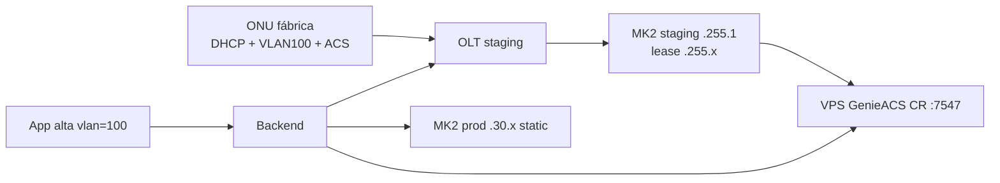

# Runbook: red de aprovisionamiento MK2 `192.168.255.0/24` (staging)

**Fecha:** 2026-08-21 (actualizado)  
**Objetivo:** **Red de aprovisionamiento** de Gigafiber. Todas las ONUs VSOL llegan aquí **antes** del alta prod: WAN **DHCP**, **VLAN 100** en TR-069, ACS/CR preconfigurados. GenieACS en el VPS alcanza la ONU vía CR en `:7547`.

Relacionado: [arquitectura-red-dual-mikrotik.md](arquitectura-red-dual-mikrotik.md), [genieacs-vsol-v2804-parametros.md](genieacs-vsol-v2804-parametros.md).

---

## Modelo operativo (fuente de verdad)

| Fase | Red | WAN CPE | VLAN TR-069 | ACS |
|------|-----|---------|-------------|-----|
| **Fábrica / pre-alta** | **Staging MK2** `192.168.255.0/24` | **DHCP** → lease `.255.100–250` | **100** | URL + credenciales Gigafiber |
| **Post-alta prod** | MK2 prod `192.168.30.0/24` | **Static** → IP del pool app | **100** (misma que OLT) | sin cambio |

**Importante:** staging **no es un lab opcional** — es la red donde **siempre** arrancan las ONUs preconfiguradas. El lease `.255.x` con `DefaultGateway=192.168.255.1` es **esperado** hasta que el alta (OLT + TR-069) migre al abonado a `.30.x`.

### Preconfiguración de fábrica (VSOL V2804AX15T)

| Parámetro | Valor |
|-----------|--------|
| `AddressingType` | **DHCP** |
| VLAN (CT + ZTE + GPON link) | **100** |
| ACS URL | `http://acs.gigafiberperu.cloud/` |
| CR user/pass | `ACS_CPE_*` en `/opt/gigafiber/genieacs/.env` |
| Lease inicial | `192.168.255.x` (pool `provisioning-255`) |
| DNS | `8.8.8.8`, `8.8.4.4` |
| Puerto WAN `:7547` | Abierto (CR desde VPS vía `wg-olt`) |

Verificado en vivo **2026-08-21** (`B46415-V2804AX15T-12345B4641531C0B6`): GPV tras CR → `DHCP`, VLAN **100** en los tres paths, IP **`192.168.255.249`**, GW **`192.168.255.1`**.

---

## Estado aplicación (2026-08-20)

Aplicado en prod para primera prueba:

| Componente | Estado |
|------------|--------|
| MK2 `192.168.255.1/24` en `LAN_MK1` | OK |
| Pool `provisioning-255` (.100–.250) | OK |
| DHCP server `dhcp-provisioning-255` | OK (lease 1h, DNS 8.8.8.8/8.8.4.4) |
| Firewall CR `:7547` + NAT staging | OK |
| VPS ruta `192.168.255.0/24` vía `wg-olt` | OK |
| VPS AllowedIPs peer MK2 incluye `.255/24` | OK |
| Ping VPS → `192.168.255.1` | OK (~83 ms) |
| Backup RouterOS | `staging-tr069-255-pre` |

### Checklist primera prueba con ONU

1. ONU de fábrica (**DHCP + VLAN 100 + ACS**) → cablear a OLT (staging).
2. Autorizar ONU en OLT → debe obtener lease **`192.168.255.x`** en MK2 (`/ip dhcp-server lease print`).
3. Verificar Inform en GenieACS: device con CR URL `http://192.168.255.x:7547/...`, GPV con VLAN **100**.
4. Alta app FIBER con **`vlan=100`** → OLT service-port + GenieACS SPV hacia IP estática **`192.168.30.x`**.
5. CR desde VPS/NBI → HTTP **200**/**202**; WAN prod + WiFi aplicados.
6. Si falla CR: revisar firewall MK2, lease DHCP staging, y `wg show` AllowedIPs.

**Nota:** `wg syncconf` en el VPS puede fallar por un quirk de `wg-quick strip` con PostUp; AllowedIPs se aplicó con `wg set` y la ruta con `ip route replace`. Tras reboot del VPS, confirmar `PostUp` y rutas (`/opt/gigafiber/genieacs/wg-olt-customer-routes.sh`).

---

## Topología staging

| Elemento | Valor |
|----------|--------|
| Gateway MK2 | `192.168.255.1/24` en bridge `LAN_MK1` (uplink VLAN 1 vía `sfp-sfpplus3`) |
| DHCP pool | `192.168.255.100` – `192.168.255.250` |
| DNS | `8.8.8.8`, `8.8.4.4` |
| Lease | 1h |
| CR GenieACS | TCP `:7547` desde VPS `10.255.255.2` (wg) |
| Prod VLAN 100 | Sin cambio — `192.168.30.1/24` en `sfp-sfpplus2` |



---

## Aplicar en MK2 (RouterOS)

Script idempotente:

`scripts/genieacs/mk2-provisioning-network-255.rsc`

Incluye: gateway, `/ip pool`, DHCP server/network, firewall CR `:7547`, NAT masquerade staging, aislamiento básico hacia `192.168.22.0/24`.

Verificar:

```
/ip address print where address~"192.168.255"
/ip dhcp-server print
/ip dhcp-server network print
/ip dhcp-server lease print
/ip firewall filter print where comment~"staging 255"
/ip firewall nat print where comment~"staging TR-069 255"
```

---

## Rutas VPS (wg-olt)

1. Extender AllowedIPs del peer MK2 con `192.168.255.0/24` — plantilla:  
   `scripts/genieacs/wg-olt-genieacs-allowedips.example`
2. PostUp/PostDown: `scripts/genieacs/wg-olt-customer-routes.sh` ya incluye `192.168.255.0/24`.
3. Verificar: `ping 192.168.255.1` desde VPS; CR a `http://192.168.255.x:7547/tr069`.

---

## VLAN desde la app (OLT + GenieACS)

Fuente única: `subscription.vlan` enviada por la app (`"1"` o `"100"`).

| Capa | Comportamiento |
|------|----------------|
| Validator FIBER | Exige vlan ∈ {1, 100} |
| SmartOLT `authorize_onu` | `FiberInstallationStrategy.resolveVlan` → app only (sin fallback `hostDevice.vlanId`) |
| GenieACS TR-069 | `Tr069ProvisionRequest.wanVlanId` = misma vlan; **no** `genieacs.wan-vlan-id` global |
| Gate | GenieACS solo si `oltProvisionStatus=COMPLETE` |
| Pool ↔ VLAN | **Staging:** lease `.255.x` (DHCP MK2) con VLAN **100** en CPE. **Prod:** VLAN 100 → IP estática `192.168.30.0/24` tras alta. |

---

## Requisitos CPE de fábrica (VSOL)

Política Gigafiber — **todas** las unidades nuevas:

| Parámetro | Valor esperado |
|-----------|----------------|
| ACS URL | `http://acs.gigafiberperu.cloud/` |
| Credenciales ACS/CR | `ACS_CPE_*` en `/opt/gigafiber/genieacs/.env` |
| WAN VLAN (TR-069) | **100** |
| WAN addressing | **DHCP** → lease staging **`192.168.255.x`** |
| Red de arranque | **Staging MK2** (`192.168.255.0/24`) — ver sección [Modelo operativo](#modelo-operativo-fuente-de-verdad) |
| DNS | `8.8.8.8`, `8.8.4.4` |
| Puerto `:7547` | Abierto en WAN para Connection Request |

Detalle TR-069 y SPV: [genieacs-vsol-v2804-parametros.md](./genieacs-vsol-v2804-parametros.md#preconfiguración-de-fábrica--staging-dhcp--vlan-100--tr-069).

---

## Checklist E2E

1. ONU en staging: **DHCP + VLAN 100** → lease **`192.168.255.x`** → Inform GenieACS.
2. Alta app FIBER con **`vlan=100`** → OLT autoriza service-port VLAN 100.
3. Tras `oltProvisionStatus=COMPLETE` → GenieACS SPV: IP estática **`192.168.30.x`** + misma VLAN + WiFi. Backend purga cola ACS antes del SPV.
4. CR desde VPS → HTTP **200** o **202**.
5. `subscription_acs.provision_status=COMPLETE` cuando SSIDs/WAN verificados en ACS.
6. Post-alta: WAN en **`.30.x`**, GW **`192.168.30.1`**.

---

## Migración staging → prod (TR-069)

Desde lease **`.255.x`** (staging) hacia IP estática **`.30.x`** (prod):

| Escenario | Comportamiento observado |
|-----------|---------------------------|
| SPV monolítico directo `.255.x` → `.30.x` en **WCD.1** | Puede fallar con CWMP **`9001 Request denied`** en `ExternalIPAddress`; además **corta CR/ACS** durante la migración |
| Secuencia manual en WCD.1 | (1) SPV unlock **`AddressingType=DHCP`** → (2) SPV **Static + `.30.x` + WiFi** |
| **Dual-WAN (backend actual)** | **WCD.1** no se toca (preconfig TR-069); **WCD.2** recibe Static `.30.x` + INTERNET — **CR activo todo el tiempo** |

Runbook dual-WAN validado prod 2026-08-22: [genieacs-vsol-v2804-parametros.md § Estrategia dual-WAN](./genieacs-vsol-v2804-parametros.md#estrategia-dual-wan-recomendada--prod-sin-perder-acs).

Si el alta falla con `9001` en IP WAN tras el flujo automático, revisar OLT VLAN 100 y reachability CR.

---

## TR-069 IP estática prod

Cuando la app envía `vlan=100` y el pool es `192.168.30.0/24`:

- **Backend (dual-WAN):** `Tr069ProvisioningService` aplica IP estática + INTERNET en **WCD.2**; WCD.1 permanece en staging para ACS. Ver [genieacs-vsol-v2804-parametros.md § Estrategia dual-WAN](./genieacs-vsol-v2804-parametros.md#estrategia-dual-wan-recomendada--prod-sin-perder-acs).

Desde preconfig fábrica **DHCP + VLAN 100** no se requiere secuencia `Enable=false` previa en WCD.2 (validado ago 2026).
