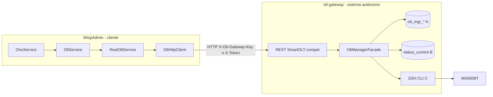

# OLT Gateway — modelo SmartOLT de 3 capas (desacoplado)

Extiende el MVP de lectura ([olt-gateway-read-mvp.md](./olt-gateway-read-mvp.md)) con persistencia propia (`olt_mgr_*`), writes CLI y API HTTP SmartOLT-compat para las **6 operaciones** que usa WispAdmin vía `RealOltService` + `OltHttpClient`.

Modelo conceptual: [olt-manager-db-model.md](./olt-manager-db-model.md).

## Frontera de desacoplamiento (obligatoria)

Política de plataforma (todos los subsistemas): [subsistemas-desacople-transporte.md](./subsistemas-desacople-transporte.md) — solo **REST** o **WebSocket**; sin JDBC ni beans cruzados.

| Regla | Detalle |
|-------|---------|
| Frontera = HTTP | El **core** **solo** consume el gateway como cliente HTTP. Prohibido inyectar `OltManagerFacade` / repos gateway en `OnuService` / `OltService`. Health/NetDiag tampoco importan tipos de `oltgateway`; usan REST (`GET /descriptor`, `GET /olts`, `GET /onus/configured`, óptica, `POST /admin/alarms/poll`). |
| Paquete autónomo | Dominio en `com.dscorp.wispadmin.oltgateway.**`. No importa `wispadmin.service` ni `wispadmin.data.model`. |
| Contratos propios | DTOs SmartOLT-compat en `oltgateway.api` (`SmartOlt*Dto`). No dependen de `wispadmin.response.*`. |
| DB con dueño claro | Tablas `olt_mgr_*` viven en schema propio (`prod_oltgateway` / `stg_oltgateway` / `dev_oltgateway`). Segundo JDBC + JPA. Health `olt_mgr_onu_optical_sample` sigue en el core. |



## Capas

| Capa | Rol | Fuente |
|------|-----|--------|
| **A** | Config deseada | `olt_mgr_onu` + catálogos (`olt`, `zone`, `onu_type`, …) |
| **B** | Telemetría cacheable | `olt_mgr_onu_status_current` (inventory + signal_poll + on-demand by-sn/optical) |
| **C** | CLI SSH | `OltCliBus` (1 sesión serializada) + writes + inventory + signal_poll |

## Tablas núcleo (`olt_mgr_*`)

Entidades JPA en `oltgateway.domain.entity`:

- Núcleo 6 ops: `olt_mgr_olt`, `olt_mgr_zone`, `olt_mgr_onu_type`, `olt_mgr_onu`, `olt_mgr_onu_status_current`, `olt_mgr_task`, `olt_mgr_audit_log`
- Catálogo: `olt_mgr_olt_model` (vendor/product/family + `max_concurrent_cli_sessions`)
- Sync: `olt_mgr_sync_run` (historial de ciclos inventory+status)
- Stubs (sin lógica aún): `olt_mgr_onu_service_port`, `olt_mgr_onu_extra_vlan`, `olt_mgr_custom_template`, `olt_mgr_speed_profile`, `olt_mgr_olt_pon_port`, `olt_mgr_olt_vlan`

Seed al arrancar (`OltMgrSeedRunner`): upsert `olt_mgr_olt_model` (`olt.gateway.model-code`) y crea/backfill `olt_mgr_olt.model`.

### Capacidad CLI y bus serializado

**Política actual:** el gateway abre **1 sola sesión SSH** (`OltCliBus`). Todas las operaciones CLI (inventory, signal_poll, adhoc, writes, keepalive) compiten en una cola priorizada. `max_concurrent_cli_sessions` del modelo queda como **máximo teórico OLT** (Reenter), no como sesiones que abre el gateway. El Reenter restante queda libre para operadores humanos/ops.

| Modelo seed | max_concurrent_cli_sessions | Uso gateway |
|-------------|----------------------------|-------------|
| `MA5608T` | **4** (Reenter OLT) | Gateway fuerza `pool-size=1` vía `OltCliBus` |

Prioridad de jobs: `WRITE` > `ADHOC` > `KEEPALIVE` > `INVENTORY` / `SIGNAL_POLL`. Syncs del mismo tipo no se encolan duplicados (`already_running` / `already_queued`). Keepalive del bus solo corre si la cola está idle.

Inventory live (`listOnusParsed` / sync):

1. Descubre topología GPON: prueba `display board 0..maxSlotProbe` y parsea **todas** las filas de la tabla chassis (`BoardParser.parseAll`). En MA5608T (V800R015), `display board 0` es vista de **frame 0** (lista SlotID 0..N); `display board 1+` suele devolver *Parameter error*. Antes solo se tomaba el slot del probe → se perdía el segundo GPFD.
2. Por cada slot GPON: intenta `display ont info 0 <slot> all` (probe 15 s). Si falla o devuelve vacío → fallback `display ont info 0 <slot> <port> all` por puerto (16 en GPFD). Los slots que requieren port-all se cachean en memoria para no repetir el probe.
3. Ejecuta todo **dentro de un job `INVENTORY` del bus** (serial, sin thread pool de workers). Si todos los jobs fallan → HTTP 504 (antes devolvía `items: []` silenciosamente).

`GET /olt/info` expone `modelCode`, `maxConcurrentCliSessions` y el inventario de boards parseado con el mismo `parseAll`.
`GET /admin/sync/status` incluye `busQueueDepth` y `busBusyJobType`.

Referencia chassis real (gigafiber MA5608T): slot 0 `H805GPFD`, slot 1 `H806GPFD`, slot 3 `H801MCUD1`, slot 4 `H801MPWD` → GPON slots `[0,1]`. Slot 0 responde bien con slot-all (~4 s, 144 ONUs). Slot 1 (613+ ONUs) hace timeout en slot-all → port-all × 16. Primera petición ~85 s; siguientes ~25 s (cache port-all en slot 1). Total ~758 ONUs.

Hibernate `ddl-auto=update` crea/actualiza tablas en la misma MySQL temporal.

### Asociaciones JPA (source of truth)

| Relación | Mapping | Notas |
|----------|---------|-------|
| OLT → OltModel | `@ManyToOne(LAZY)` | Catálogo de capacidad CLI |
| ONU → OLT / Zone / OnuType / CustomTemplate | `@ManyToOne(LAZY)` unidireccional | Columnas `olt_id`, `zone_id`, …; sin `Long oltId` duplicado |
| ONU ↔ status_current | `@OneToOne` + `@MapsId` | PK de status = `onu_id`; cascade ALL desde ONU |
| Task / Audit → OLT / ONU | `@ManyToOne(LAZY)` opcional | Sin `@OneToMany` inverso (listados por repo) |
| Stubs service_port / extra_vlan / pon_port / vlan | `@ManyToOne(LAZY)` | Speed profiles en service_port |

Configured list usa `@EntityGraph(attributePaths = ["status"])` para evitar N+1.

FKs SQL explícitas (MySQL): [`scripts/olt_mgr_fk.sql`](../scripts/olt_mgr_fk.sql). Aplicar manualmente tras limpiar huérfanos; `ddl-auto=update` no las crea de forma fiable.

API sigue exponiendo solo DTOs `data class` — nunca entidades JPA.

## API HTTP (contrato estable)

Base: `/ispadmin/api/olt-gateway`

### Nativa (lectura C/B)

Igual que el MVP: `/health`, `/olt/info`, `/onus` (CLI live), `/onus/autofind`, `/onus/by-sn/{sn}`, detalle/optical.

| Path | Fuente | Notas |
|------|--------|-------|
| `GET /onus` | CLI SSH live | No persiste |
| `GET /onus/configured?page=&size=` | DB A+B | Paginado; incluye rx/tx/oltRx/signalCategory; sin SSH |
| `POST /admin/sync/inventory` | Sync SSH→DB | Dispara ciclo manual; API key |
| `POST /admin/sync/signal` | Signal poll SSH→DB | 1 job `SIGNAL_POLL` en el bus; API key |
| `GET /admin/sync/status` | Memoria | inventory + signal + `busQueueDepth` / `busBusyJobType` |

### Aliases SmartOLT (usados por WispAdmin)

| Op | Path | Capas |
|----|------|-------|
| Unconfigured | `GET onu/unconfigured_onus` | C → JSON A-light |
| By SN | `GET onu/get_onus_details_by_sn/{sn}` | A+B (+ hydrate C) |
| Authorize | `POST onu/authorize_onu` | task → C → A → audit |
| Move | `POST onu/move/{sn}` | task → C → A → audit |
| Delete | `POST onu/delete/{externalId}` | task → C → soft-delete A → audit |
| Reboot | `POST onu/reboot/{externalId}` | task → C → audit |

Auth: `X-Olt-Gateway-Key` (también acepta `X-Token` como alias).

## Cableado WispAdmin (solo cliente)

Sin `GatewayBackedOltService`. Misma `RealOltService` + `OltHttpClient`.

```properties
olt.service.provider=gateway
olt.service.base-url=http://localhost:8080/ispadmin/api/olt-gateway/
olt.service.api-key=${OLT_GATEWAY_API_KEY}
```

`provider=gateway` hace que `OltHttpClient` envíe `X-Olt-Gateway-Key` en lugar de `X-Token`. Override opcional: `olt.service.auth-header`.

`MockOltService` sigue disponible con `olt.service.mock.enabled=true`.

## Writes CLI

`OltGatewayCommandService` + flag `olt.gateway.writes.enabled` (default `false`).

Comandos (MA5608T): `ont add` / `ont delete` / `ont reboot` + `service-port`. Fixtures TDD en `src/test/resources/oltgateway/fixtures/writes/`.

En mock (`olt.gateway.mock.enabled=true`) el runner CLI es no-op (no SSH).

## Sync SSH → DB (inventory + signal)

Jobs desacoplados en `oltgateway.**`. Ambos encolan en `OltCliBus` (1 sesión); no se solapan en ejecución CLI (cola serial). No acoplan dominio WispAdmin.

### Inventory — cadencia

| Parámetro | Default | Propiedad |
|-----------|---------|-----------|
| Enabled | `true` | `olt.gateway.sync.inventory-enabled` |
| Intervalo | **10 min** tras terminar (`fixedDelay`) | `olt.gateway.sync.inventory-interval-ms=600000` |
| Initial delay | **30 s** | `olt.gateway.sync.inventory-initial-delay-ms=30000` |
| Skip si write running | `true` | `olt.gateway.sync.skip-when-write-running` |

### Signal poll — cadencia

| Parámetro | Default | Propiedad |
|-----------|---------|-----------|
| Enabled | `true` | `olt.gateway.sync.signal-enabled` |
| Intervalo | **10 min** tras terminar (`fixedDelay`) | `olt.gateway.sync.signal-interval-ms=600000` |
| Initial delay | **90 s** | `olt.gateway.sync.signal-initial-delay-ms=90000` |

Guards comunes: `AtomicBoolean` por tipo, skip `write_task_running`, bus skip `already_running` / `already_queued` del mismo `CliJobType`.

### Fuente CLI inventory

Misma que `GET /onus`: 1× `display ont info 0 all` → `listOnusParsed()` → `ParsedOnuSummary`.

### Fuente CLI signal

Por slot GPON, en la misma sesión del job `SIGNAL_POLL`: `interface gpon 0/{slot}` + `display ont optical-info {port} all` + `quit`. Persistencia óptica en capa B (`onu_rx_dbm`, `onu_tx_dbm`, `olt_rx_dbm`, `temperature_c`, `signal_category`, `polled_at`).

### Merge rules (clave = SN)

| Caso | Acción |
|------|--------|
| Insert | SN en OLT, no en DB → crear A (`importedFromOlt=true`, `syncedAfterImport=false`, `name`=description CLI, `externalId={oltKey}_{slot}_{port}_{ontId}`) + B (`runState`/`matchState`/`polledAt`) |
| Update `importedFromOlt=true` | Actualizar posición PON + `externalId` + `name` desde description + B |
| Update `importedFromOlt=false` (API/CRM) | Solo posición PON + B; **no** pisar `name`, `zoneId`, `onuTypeId`, `mainVlanId`, `address`, `contact`, `mode`, `administrativeStatus` |
| Missing | Activa en DB, ausente en snapshot CLI → soft-delete (`deletedAt`) + audit `sync_missing_on_olt` |
| Reappear | Soft-deleted vuelve en CLI → clear `deletedAt`, refresh posición + B |
| Posición cambia | Confiar en OLT; audit `sync_position_changed` |

Snapshot completo en memoria → apply (sin TX gigante única). Historial en `olt_mgr_sync_run`.

### Endpoints

- `POST /api/olt-gateway/admin/sync/inventory` → `SyncResultDto`
- `POST /api/olt-gateway/admin/sync/signal` → `SignalPollResultDto` (`slotsPolled`, `portsPolled`, `onusUpdated`, …)
- `GET /api/olt-gateway/admin/sync/status` → inventory + signal + bus
- `GET /api/olt-gateway/onus/configured` → A+B paginado (DB, con ópticos)
- `GET /api/olt-gateway/onus` → sigue siendo CLI live

## Extracción futura (app/DB propia)

1. Mover paquete `oltgateway` a repo/Boot app `com.gigafiber.oltgateway`.
2. `spring.datasource` propio apuntando a DB del gateway.
3. Quitar `oltgateway` del `scanBasePackages` / `@EntityScan` de WispAdmin.
4. Contrato estable que permanece: API HTTP + schema `olt_mgr_*`.

Hoy el JAR puede ser el mismo Spring Boot por conveniencia de deploy; la dependencia de código es unidireccional (wispadmin → HTTP → gateway).

## Variables

| Variable | Uso |
|----------|-----|
| `gigafiber.subsystems.oltgateway.enabled` | Incluye el paquete del gateway en el WAR. `OLT_GATEWAY_ENABLED` se eliminó. |
| `OLT_GATEWAY_MOCK_ENABLED` / `OLT_GATEWAY_MOCK` | Sin SSH (fixtures) |
| `OLT_GATEWAY_WRITES_ENABLED` | Permite authorize/move/delete/reboot CLI |
| `OLT_GATEWAY_SYNC_INVENTORY_ENABLED` | Scheduler inventory+status |
| `OLT_GATEWAY_SYNC_INVENTORY_INTERVAL_MS` | fixedDelay ms (default 600000) |
| `OLT_GATEWAY_SYNC_INVENTORY_INITIAL_DELAY_MS` | initialDelay ms (default 30000) |
| `OLT_GATEWAY_SYNC_SIGNAL_ENABLED` | Scheduler signal_poll |
| `OLT_GATEWAY_SYNC_SIGNAL_INTERVAL_MS` | fixedDelay ms (default 600000) |
| `OLT_GATEWAY_SYNC_SIGNAL_INITIAL_DELAY_MS` | initialDelay ms (default 90000) |
| `OLT_GATEWAY_SYNC_SKIP_WHEN_WRITE_RUNNING` | Omite sync si hay task write running |
| `OLT_SERVICE_PROVIDER` | `smartolt` \| `gateway` (solo header + URL) |
| `OLT_SERVICE_BASE_URL` | Base HTTP del proveedor OLT |
| `OLT_SERVICE_API_KEY` | Key enviada al proveedor |

## Fuera de esta fase

- Poll autofind persistente / `onu_metric_sample` / SNMP.
- Zone/VLAN/Type/CATV / SmartOLT `get_onus_signals`.
- Paralelismo multi-sesión del bus (fase futura).
- Mismatch auto-fix / resync DB→OLT / presets / UI IspManager.
- Extracción física a otro proceso/repo.
- Writes habilitados en prod sin validación en lab.
