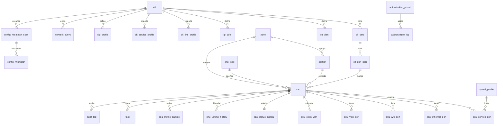

# Modelo de base de datos — OLT Manager (clon funcional de SmartOLT)

Diseño de DB propia para replicar el funcionamiento de SmartOLT al 100%, derivado del
recorrido completo de la UI (`gigafiberperu.smartolt.com`, v3.53.0) y de su API.
Complementa: [smartolt-onu-data-model.md](./smartolt-onu-data-model.md).

> **Ownership (fase 3 capas):** las tablas se materializan en MySQL con prefijo `olt_mgr_*`
> (`olt_mgr_onu`, `olt_mgr_task`, …) y son dueñas del paquete `com.dscorp.wispadmin.oltgateway`.
> WispAdmin no escribe ahí; solo consume la API HTTP del gateway. Ver
> [olt-gateway-3layer.md](./olt-gateway-3layer.md). Misma JDBC URL hoy = despliegue temporal.
>
> **JPA:** las asociaciones (`@ManyToOne` LAZY, `@OneToOne`+`@MapsId` en status) son la source of
> truth del grafo en código. FKs SQL alineadas en [`scripts/olt_mgr_fk.sql`](../scripts/olt_mgr_fk.sql).
>
> **Modelo OLT:** tabla `olt_mgr_olt_model` (code/vendor/product + `max_concurrent_cli_sessions` + `max_concurrent_snmp_walks`).
> `olt_mgr_olt.model_id` apunta al catálogo. Política: users CLI exclusivos del gateway → inventory
> usa todas las sesiones (`N`). Ver [olt-gateway-3layer.md](./olt-gateway-3layer.md).

Evidencia usada: vista ONU (`/onu/view/3`) con todos sus modales (los `name` de los
formularios revelan el esquema interno: `onu_type_id`, `custom_template_id`,
`line_profile_maptype`, `extra_vlan_id`, `tag_transform_mode`, `network_port_id`,
`mgmt_ip_*`, `sip_profile_id`, `odb_id`, `odb_port`, `location_name`…), catálogos de
Settings, presets, tasks, events, audit log y config mismatch.

## Principios

1. **La DB es la config deseada** (fuente de verdad). La OLT se sincroniza desde la DB
   (resync/rebuild) y se audita contra ella (mismatch scan).
2. **Telemetría separada de config**: status/señal/tráfico se actualizan por poll y no
   tocan las filas de configuración.
3. **Todo cambio pasa por una tarea** (`task`) y deja rastro en `audit_log`.
4. Claves de integración: `sn` (única física) y `external_id` (lógica). El id autoincremental
   es interno (equivale al `/onu/view/{id}` web de SmartOLT; no se expone a integraciones).

## Diagrama (núcleo)



## DDL propuesto (PostgreSQL; tipos ajustables a MySQL)

### 1. Infraestructura OLT

```sql
CREATE TABLE olt (
    id                   BIGSERIAL PRIMARY KEY,
    name                 VARCHAR(64) NOT NULL,
    ip_address           INET NOT NULL,
    mgmt_protocol        VARCHAR(10) NOT NULL DEFAULT 'ssh',      -- ssh | telnet
    mgmt_port            INT NOT NULL DEFAULT 22,
    username_enc         TEXT NOT NULL,
    password_enc         TEXT NOT NULL,
    snmp_ro_community_enc TEXT,
    snmp_rw_community_enc TEXT,
    snmp_udp_port        INT DEFAULT 161,
    snmp_trap_enabled    BOOLEAN NOT NULL DEFAULT FALSE,
    iptv_module_enabled  BOOLEAN NOT NULL DEFAULT FALSE,
    hardware_version     VARCHAR(64),                             -- Huawei-MA5608T
    software_version     VARCHAR(64),                             -- R015 (detectado)
    supported_pon_types  VARCHAR(64),                             -- GPON,XGPON,XGSPON
    behind_vpn           BOOLEAN NOT NULL DEFAULT FALSE,
    tr069_default_profile_id BIGINT,
    tr069_default_interface  VARCHAR(8) DEFAULT 'mgmt',           -- mgmt | wan
    ntp_servers          VARCHAR(255),                            -- CSV, se empuja a la OLT
    enabled              BOOLEAN NOT NULL DEFAULT TRUE,
    created_at           TIMESTAMPTZ NOT NULL DEFAULT now(),
    updated_at           TIMESTAMPTZ NOT NULL DEFAULT now()
);

CREATE TABLE olt_card (               -- pestaña "OLT cards"
    id        BIGSERIAL PRIMARY KEY,
    olt_id    BIGINT NOT NULL REFERENCES olt(id),
    slot      INT NOT NULL,
    card_type VARCHAR(32),                                        -- GPBD, MCUD...
    ports     INT,
    status    VARCHAR(16),                                        -- normal/failed (poll)
    UNIQUE (olt_id, slot)
);

CREATE TABLE olt_pon_port (           -- pestaña "PON ports"
    id              BIGSERIAL PRIMARY KEY,
    olt_id          BIGINT NOT NULL REFERENCES olt(id),
    board           INT NOT NULL,
    port            INT NOT NULL,
    pon_type        VARCHAR(8) NOT NULL DEFAULT 'gpon',
    default_vlan_id INT,                                          -- para "Move ONU"
    admin_enabled   BOOLEAN NOT NULL DEFAULT TRUE,
    description     VARCHAR(128),
    max_onu_id      INT DEFAULT 127,                              -- rango 0-127 / 128-255
    UNIQUE (olt_id, board, port)
);

CREATE TABLE olt_uplink_port (
    id      BIGSERIAL PRIMARY KEY,
    olt_id  BIGINT NOT NULL REFERENCES olt(id),
    name    VARCHAR(32) NOT NULL,
    UNIQUE (olt_id, name)
);

CREATE TABLE olt_vlan (               -- pestaña "VLANs"
    id      BIGSERIAL PRIMARY KEY,
    olt_id  BIGINT NOT NULL REFERENCES olt(id),
    vlan_id INT NOT NULL,
    purpose VARCHAR(16) NOT NULL DEFAULT 'user',                  -- user|mgmt|voip|iptv|tls
    description VARCHAR(128),
    UNIQUE (olt_id, vlan_id)
);

CREATE TABLE ip_pool (                -- "ONU IP Pools" (mgmt / WAN static / VoIP)
    id          BIGSERIAL PRIMARY KEY,
    olt_id      BIGINT NOT NULL REFERENCES olt(id),
    purpose     VARCHAR(12) NOT NULL,                             -- mgmt|wan_static|voip
    vlan_id     INT,
    network_cidr CIDR NOT NULL,
    gateway     INET,
    dns1        INET,
    dns2        INET,
    range_start INET NOT NULL,
    range_end   INET NOT NULL
);

CREATE TABLE ip_allocation (
    id          BIGSERIAL PRIMARY KEY,
    ip_pool_id  BIGINT NOT NULL REFERENCES ip_pool(id),
    onu_id      BIGINT NOT NULL,                                  -- FK onu(id)
    ip_address  INET NOT NULL,
    allocated_at TIMESTAMPTZ NOT NULL DEFAULT now(),
    UNIQUE (ip_pool_id, ip_address)
);

CREATE TABLE olt_line_profile (       -- profiles importados de la OLT
    id          BIGSERIAL PRIMARY KEY,
    olt_id      BIGINT NOT NULL REFERENCES olt(id),
    olt_profile_id INT NOT NULL,
    name        VARCHAR(64) NOT NULL,                             -- line-profile_10
    map_type    VARCHAR(8),                                       -- vlan | prio
    UNIQUE (olt_id, olt_profile_id)
);

CREATE TABLE olt_service_profile (
    id          BIGSERIAL PRIMARY KEY,
    olt_id      BIGINT NOT NULL REFERENCES olt(id),
    olt_profile_id INT NOT NULL,
    name        VARCHAR(64) NOT NULL,                             -- srv-profile_10
    UNIQUE (olt_id, olt_profile_id)
);

CREATE TABLE sip_profile (            -- "VoIP profiles" por OLT
    id       BIGSERIAL PRIMARY KEY,
    olt_id   BIGINT NOT NULL REFERENCES olt(id),
    name     VARCHAR(64) NOT NULL,
    sip_server VARCHAR(128),
    sip_port INT,
    settings JSONB
);

CREATE TABLE tr069_profile (
    id       BIGSERIAL PRIMARY KEY,
    name     VARCHAR(64) NOT NULL UNIQUE,                         -- "SmartOLT", "Disabled" es NULL
    acs_url  VARCHAR(255),
    settings JSONB
);

CREATE TABLE olt_config_backup (      -- "Config backups"
    id        BIGSERIAL PRIMARY KEY,
    olt_id    BIGINT NOT NULL REFERENCES olt(id),
    taken_at  TIMESTAMPTZ NOT NULL DEFAULT now(),
    content   TEXT NOT NULL,                                      -- running-config
    trigger   VARCHAR(16) NOT NULL DEFAULT 'manual'               -- manual|scheduled|pre_change
);
```

### 2. Catálogos de negocio

```sql
CREATE TABLE zone (                   -- "simple display separations"
    id   BIGSERIAL PRIMARY KEY,
    name VARCHAR(64) NOT NULL UNIQUE
);

CREATE TABLE splitter (               -- ODB / caja de distribución
    id        BIGSERIAL PRIMARY KEY,
    zone_id   BIGINT REFERENCES zone(id),
    name      VARCHAR(64) NOT NULL,
    capacity  INT NOT NULL DEFAULT 8,                             -- para % de uso
    latitude  NUMERIC(9,6),
    longitude NUMERIC(9,6)
);

CREATE TABLE onu_type (               -- catálogo hardware ONU
    id             BIGSERIAL PRIMARY KEY,
    name           VARCHAR(64) NOT NULL UNIQUE,                   -- XN020-G3v
    pon_type       VARCHAR(8) NOT NULL DEFAULT 'gpon',
    channels       VARCHAR(8) NOT NULL DEFAULT 'G',               -- G / XG / XGS
    ethernet_ports INT NOT NULL DEFAULT 1,
    wifi_ports     INT NOT NULL DEFAULT 0,
    voip_ports     INT NOT NULL DEFAULT 0,
    catv_ports     INT NOT NULL DEFAULT 0,
    allow_custom_profiles BOOLEAN NOT NULL DEFAULT TRUE,
    capability     VARCHAR(20) NOT NULL DEFAULT 'bridging_routing' -- bridging|bridging_routing
);

CREATE TABLE speed_profile (
    id         BIGSERIAL PRIMARY KEY,
    name       VARCHAR(32) NOT NULL,                              -- 10M..1G
    direction  VARCHAR(8) NOT NULL,                               -- download | upload
    speed_kbps BIGINT NOT NULL,
    is_default BOOLEAN NOT NULL DEFAULT FALSE,
    use_prefix_suffix BOOLEAN NOT NULL DEFAULT FALSE,
    UNIQUE (name, direction)
);

CREATE TABLE custom_template (        -- "Custom profile" Generic_1..7
    id      BIGSERIAL PRIMARY KEY,
    name    VARCHAR(64) NOT NULL UNIQUE,
    content TEXT                                                  -- plantilla de comandos
);
```

### 3. ONU (config deseada — fuente de verdad)

```sql
CREATE TABLE onu (
    id            BIGSERIAL PRIMARY KEY,
    sn            VARCHAR(32) NOT NULL UNIQUE,
    external_id   VARCHAR(64) NOT NULL UNIQUE,                    -- unique_external_id API
    -- posición PON
    olt_id        BIGINT NOT NULL REFERENCES olt(id),
    board         INT NOT NULL,
    port          INT NOT NULL,
    onu_index     INT NOT NULL,                                   -- ONT-ID en el puerto
    pon_type      VARCHAR(8) NOT NULL DEFAULT 'gpon',
    gpon_channel  VARCHAR(8) NOT NULL DEFAULT 'gpon',             -- gpon|xgpon|xgspon
    -- clasificación
    onu_type_id   BIGINT NOT NULL REFERENCES onu_type(id),
    custom_template_id BIGINT REFERENCES custom_template(id),
    line_profile_maptype VARCHAR(8) NOT NULL DEFAULT 'vlan',      -- vlan | prio
    imported_line_profile_id BIGINT REFERENCES olt_line_profile(id),
    imported_service_profile_id BIGINT REFERENCES olt_service_profile(id),
    -- ubicación / CRM
    zone_id       BIGINT REFERENCES zone(id),
    splitter_id   BIGINT REFERENCES splitter(id),
    splitter_port INT,
    name          VARCHAR(128),
    address       VARCHAR(255),
    contact       VARCHAR(128),
    latitude      NUMERIC(9,6),
    longitude     NUMERIC(9,6),
    -- modo WAN
    mode          VARCHAR(12) NOT NULL DEFAULT 'routing',         -- routing | bridging
    wan_mode      VARCHAR(24) NOT NULL DEFAULT 'onu_webpage',     -- onu_webpage|dhcp|static|pppoe
    configuration_method VARCHAR(8) NOT NULL DEFAULT 'omci',      -- omci | tr069
    main_vlan_id  INT NOT NULL,                                   -- WAN VLAN
    wan_ip_source VARCHAR(8),                                     -- pool | manual
    wan_ip_pool_id BIGINT REFERENCES ip_pool(id),
    ip_address    INET, subnet_mask INET, default_gateway INET,
    dns1 INET, dns2 INET,
    ip_protocol   VARCHAR(12) DEFAULT 'ipv4',                     -- ipv4|ipv6|dual
    ipv6_address_mode VARCHAR(12), ipv6_prefix_mode VARCHAR(12),
    pppoe_username VARCHAR(64), pppoe_password_enc TEXT,
    -- mgmt IP
    mgmt_ip_mode  VARCHAR(10) NOT NULL DEFAULT 'inactive',        -- inactive|static|dhcp
    mgmt_vlan_id  INT,
    mgmt_ip_pool_id BIGINT REFERENCES ip_pool(id),
    mgmt_ip_address INET, mgmt_subnet_mask INET, mgmt_default_gateway INET,
    mgmt_dns1 INET, mgmt_dns2 INET,
    mgmt_svlan_id INT, mgmt_cvlan_id INT, mgmt_tag_transform VARCHAR(20),
    mgmt_dhcp_option82 BOOLEAN NOT NULL DEFAULT FALSE,
    mgmt_allow_remote_access BOOLEAN NOT NULL DEFAULT FALSE,
    -- TR069
    tr069_profile_id BIGINT REFERENCES tr069_profile(id),
    tr069_interface  VARCHAR(8) DEFAULT 'mgmt',                   -- mgmt | wan
    tr069_device_id  VARCHAR(64),
    -- IPTV / CATV
    iptv_enabled  BOOLEAN NOT NULL DEFAULT FALSE,
    iptv_settings JSONB,                                          -- vlan/cvlan/svlan/speeds/macs
    catv_enabled  BOOLEAN NOT NULL DEFAULT FALSE,
    -- acceso web ONU
    web_user VARCHAR(64), web_password_enc TEXT,
    -- estado administrativo / ciclo de vida
    administrative_status VARCHAR(10) NOT NULL DEFAULT 'enabled', -- enabled | disabled
    emergency_stopped BOOLEAN NOT NULL DEFAULT FALSE,             -- Stop ONU (O7)
    authorization_date TIMESTAMPTZ,
    authorized_by_user_id BIGINT,
    authorization_preset_id BIGINT,
    imported_from_olt BOOLEAN NOT NULL DEFAULT FALSE,
    synced_after_import BOOLEAN NOT NULL DEFAULT TRUE,            -- banner "use Resync"
    last_resync_failed BOOLEAN NOT NULL DEFAULT FALSE,            -- filtro "Resync failed"
    last_resync_at TIMESTAMPTZ,
    created_at TIMESTAMPTZ NOT NULL DEFAULT now(),
    updated_at TIMESTAMPTZ NOT NULL DEFAULT now(),                -- alimenta updated_since API
    deleted_at TIMESTAMPTZ,
    UNIQUE (olt_id, board, port, onu_index)
);
CREATE INDEX idx_onu_zone ON onu(zone_id);
CREATE INDEX idx_onu_updated ON onu(updated_at);

CREATE TABLE onu_service_port (       -- tabla "Speed profiles" de la vista ONU
    id            BIGSERIAL PRIMARY KEY,
    onu_id        BIGINT NOT NULL REFERENCES onu(id) ON DELETE CASCADE,
    olt_service_port_id INT,                                      -- id real en la OLT (58)
    user_vlan_id  INT NOT NULL,
    cvlan_id      INT,
    svlan_id      INT,
    tag_transform VARCHAR(20) NOT NULL DEFAULT 'translate',       -- translate|default|translate-and-add|transparent
    download_speed_profile_id BIGINT REFERENCES speed_profile(id),
    upload_speed_profile_id   BIGINT REFERENCES speed_profile(id),
    UNIQUE (onu_id, user_vlan_id)
);

CREATE TABLE onu_extra_vlan (         -- "Attached VLANs"
    onu_id  BIGINT NOT NULL REFERENCES onu(id) ON DELETE CASCADE,
    vlan_id INT NOT NULL,
    PRIMARY KEY (onu_id, vlan_id)
);

CREATE TABLE onu_ethernet_port (
    id            BIGSERIAL PRIMARY KEY,
    onu_id        BIGINT NOT NULL REFERENCES onu(id) ON DELETE CASCADE,
    port_no       INT NOT NULL,                                   -- eth_0/1 → 1
    admin_enabled BOOLEAN NOT NULL DEFAULT TRUE,
    mode          VARCHAR(12) NOT NULL DEFAULT 'lan',             -- lan|access|hybrid|trunk|transparent
    vlan_id       INT,
    allowed_vlans VARCHAR(255),
    dhcp_control  VARCHAR(16) NOT NULL DEFAULT 'no_control',
    UNIQUE (onu_id, port_no)
);

CREATE TABLE onu_wifi_port (
    id       BIGSERIAL PRIMARY KEY,
    onu_id   BIGINT NOT NULL REFERENCES onu(id) ON DELETE CASCADE,
    port_no  INT NOT NULL,
    enabled  BOOLEAN NOT NULL DEFAULT FALSE,
    ssid     VARCHAR(64),
    password_enc TEXT,
    settings JSONB,
    UNIQUE (onu_id, port_no)
);

CREATE TABLE onu_voip_port (
    id             BIGSERIAL PRIMARY KEY,
    onu_id         BIGINT NOT NULL REFERENCES onu(id) ON DELETE CASCADE,
    port_no        INT NOT NULL,                                  -- TEL 1..n
    enabled        BOOLEAN NOT NULL DEFAULT FALSE,
    sip_profile_id BIGINT REFERENCES sip_profile(id),
    phone_number   VARCHAR(32),
    password_enc   TEXT,
    voip_ip_settings JSONB,                                       -- modo/ip/vlan/svlan/cvlan
    UNIQUE (onu_id, port_no)
);
```

### 4. Telemetría (poll; nunca mezclar con config)

```sql
CREATE TABLE onu_status_current (     -- upsert por job de poll (columna Status/Signal)
    onu_id            BIGINT PRIMARY KEY REFERENCES onu(id) ON DELETE CASCADE,
    run_state         VARCHAR(12) NOT NULL,                       -- online|offline|los|power_fail|disabled
    last_status_change TIMESTAMPTZ,
    last_down_cause   VARCHAR(32),                                -- dying-gasp, LOS...
    signal_category   VARCHAR(10),                                -- good|warning|critical
    onu_rx_dbm        NUMERIC(6,2),                               -- 1490nm (signal_1490)
    olt_rx_dbm        NUMERIC(6,2),                               -- 1310nm (signal_1310)
    onu_tx_dbm        NUMERIC(6,2),
    temperature_c     INT,
    distance_m        INT,
    match_state       VARCHAR(10),                                -- match | mismatch (CLI)
    polled_at         TIMESTAMPTZ NOT NULL
);

CREATE TABLE onu_uptime_history (     -- history up/down de la OLT (Get status)
    id         BIGSERIAL PRIMARY KEY,
    onu_id     BIGINT NOT NULL REFERENCES onu(id) ON DELETE CASCADE,
    up_at      TIMESTAMPTZ,
    down_at    TIMESTAMPTZ,
    down_cause VARCHAR(32)
);

CREATE TABLE onu_metric_sample (      -- series para Graphs (tráfico + señal)
    onu_id       BIGINT NOT NULL REFERENCES onu(id) ON DELETE CASCADE,
    ts           TIMESTAMPTZ NOT NULL,
    download_bps BIGINT,
    upload_bps   BIGINT,
    onu_rx_dbm   NUMERIC(6,2),
    olt_rx_dbm   NUMERIC(6,2),
    PRIMARY KEY (onu_id, ts)
);
-- retención estilo RRD: raw 24-48h + rollups 5min/1h/1d (job de agregación o TimescaleDB)

CREATE TABLE olt_metric_sample (      -- uptime, temp, fans, voltaje, potencia
    olt_id      BIGINT NOT NULL REFERENCES olt(id),
    ts          TIMESTAMPTZ NOT NULL,
    uptime_s    BIGINT,
    temperature_c INT,
    fan_pct     INT,
    voltage_v   NUMERIC(6,2),
    power_w     INT,
    PRIMARY KEY (olt_id, ts)
);

CREATE TABLE onu_mac_snapshot (       -- "MACs on OLT from this ONU"
    id          BIGSERIAL PRIMARY KEY,
    onu_id      BIGINT NOT NULL REFERENCES onu(id) ON DELETE CASCADE,
    service_port INT,
    mac_address MACADDR NOT NULL,
    vlan_id     INT,
    seen_at     TIMESTAMPTZ NOT NULL
);
```

### 5. Autofind y autorización

```sql
CREATE TABLE unconfigured_onu (       -- pantalla "Unconfigured" (autofind)
    id            BIGSERIAL PRIMARY KEY,
    olt_id        BIGINT NOT NULL REFERENCES olt(id),
    board         INT, port INT,
    sn            VARCHAR(32) NOT NULL,
    detected_onu_type VARCHAR(64),                                -- equipment-id autofind
    first_seen_at TIMESTAMPTZ NOT NULL DEFAULT now(),
    last_seen_at  TIMESTAMPTZ NOT NULL DEFAULT now(),
    state         VARCHAR(16) NOT NULL DEFAULT 'pending',         -- pending|authorized|saved_for_later|gone
    UNIQUE (olt_id, sn)
);

CREATE TABLE authorization_preset (   -- Settings → Authorization presets
    id          BIGSERIAL PRIMARY KEY,
    name        VARCHAR(64) NOT NULL UNIQUE,
    description VARCHAR(255),
    enabled     BOOLEAN NOT NULL DEFAULT TRUE,
    is_default  BOOLEAN NOT NULL DEFAULT FALSE,
    -- condiciones de match
    olt_id      BIGINT REFERENCES olt(id),
    board       INT, port INT,
    sn_pattern  VARCHAR(64),
    onu_type_id BIGINT REFERENCES onu_type(id),                   -- NULL = auto-detect
    fallback_onu_type_id BIGINT REFERENCES onu_type(id),
    -- plantilla de settings (espejo de onu.*; JSONB para no duplicar 40 columnas)
    settings    JSONB NOT NULL
);

CREATE TABLE authorization_log (      -- Reports → Authorizations
    id        BIGSERIAL PRIMARY KEY,
    onu_id    BIGINT REFERENCES onu(id),
    sn        VARCHAR(32) NOT NULL,
    pon_type  VARCHAR(8),
    preset_id BIGINT REFERENCES authorization_preset(id),
    user_id   BIGINT,                                             -- NULL si auto/API
    source    VARCHAR(8) NOT NULL DEFAULT 'ui',                   -- ui|api|auto
    authorized_at TIMESTAMPTZ NOT NULL DEFAULT now()
);
```

### 6. Operación: tareas, auditoría, eventos, mismatch

```sql
CREATE TABLE task (                   -- pantalla Tasks + toda acción hacia la OLT
    id          BIGSERIAL PRIMARY KEY,
    olt_id      BIGINT REFERENCES olt(id),
    onu_id      BIGINT REFERENCES onu(id),
    type        VARCHAR(24) NOT NULL,  -- authorize|resync|auto_resync|move|auto_move|finalize|reboot|
                                       -- disable|enable|stop|start|delete|restore_defaults|firmware_upgrade|
                                       -- save_config|autofind_scan|status_poll|signal_poll|mismatch_scan
    payload     JSONB,
    status      VARCHAR(10) NOT NULL DEFAULT 'queued',            -- queued|running|success|failed
    requested_by_user_id BIGINT,                                  -- NULL = System/API
    source      VARCHAR(8) NOT NULL DEFAULT 'ui',
    error       TEXT,
    created_at  TIMESTAMPTZ NOT NULL DEFAULT now(),
    started_at  TIMESTAMPTZ,
    finished_at TIMESTAMPTZ
);
CREATE INDEX idx_task_status ON task(status, created_at);

CREATE TABLE audit_log (              -- /info global + modal History por ONU
    id          BIGSERIAL PRIMARY KEY,
    olt_id      BIGINT,
    onu_id      BIGINT,
    action      VARCHAR(64) NOT NULL,                             -- "Imported from OLT config", "Update location"...
    user_id     BIGINT,                                           -- NULL = System
    source      VARCHAR(8) NOT NULL DEFAULT 'ui',                 -- ui|api|system
    ip_address  INET,
    details     JSONB,                                            -- diff antes/después
    created_at  TIMESTAMPTZ NOT NULL DEFAULT now()
);
CREATE INDEX idx_audit_onu ON audit_log(onu_id, created_at);

CREATE TABLE network_event (          -- pantalla Events
    id          BIGSERIAL PRIMARY KEY,
    olt_id      BIGINT REFERENCES olt(id),
    severity    VARCHAR(10) NOT NULL,                             -- critical|warning|info
    event_type  VARCHAR(24) NOT NULL,                             -- pon_outage|olt_unreachable|onu_flood...
    source      VARCHAR(64),                                      -- ej. gpon 0/1/0
    message     TEXT NOT NULL,
    status      VARCHAR(10) NOT NULL DEFAULT 'active',            -- active|resolved
    started_at  TIMESTAMPTZ NOT NULL DEFAULT now(),
    resolved_at TIMESTAMPTZ
);

CREATE TABLE config_mismatch_scan (   -- "Find config mismatches (DB vs OLT)"
    id          BIGSERIAL PRIMARY KEY,
    olt_id      BIGINT NOT NULL REFERENCES olt(id),
    trigger     VARCHAR(8) NOT NULL DEFAULT 'manual',             -- manual|daily
    auto_fix    BOOLEAN NOT NULL DEFAULT FALSE,                   -- "Auto-fix: DB → OLT"
    status      VARCHAR(10) NOT NULL DEFAULT 'running',
    started_at  TIMESTAMPTZ NOT NULL DEFAULT now(),
    finished_at TIMESTAMPTZ
);

CREATE TABLE config_mismatch (
    id        BIGSERIAL PRIMARY KEY,
    scan_id   BIGINT NOT NULL REFERENCES config_mismatch_scan(id) ON DELETE CASCADE,
    onu_id    BIGINT REFERENCES onu(id),
    field     VARCHAR(48) NOT NULL,                               -- admin_state|catv|vlan|missing_on_olt|twin_offline
    db_value  TEXT,
    olt_value TEXT,
    fixed     BOOLEAN NOT NULL DEFAULT FALSE,
    fixed_at  TIMESTAMPTZ
);
```

### 7. Plataforma (usuarios, API, settings)

```sql
CREATE TABLE app_user (
    id       BIGSERIAL PRIMARY KEY,
    email    VARCHAR(128) NOT NULL UNIQUE,
    role     VARCHAR(16) NOT NULL DEFAULT 'admin',                -- admin|installer|readonly
    password_hash TEXT NOT NULL,
    enabled  BOOLEAN NOT NULL DEFAULT TRUE
    -- permiso granular (ej. batch actions) → tabla user_permission si crece
);

CREATE TABLE api_key (
    id        BIGSERIAL PRIMARY KEY,
    token_hash TEXT NOT NULL UNIQUE,
    name      VARCHAR(64),
    enabled   BOOLEAN NOT NULL DEFAULT TRUE,
    created_at TIMESTAMPTZ NOT NULL DEFAULT now()
);

CREATE TABLE api_request_log (        -- API Logs + rate limiting (1000/h, 10/s; heavy 30/10min)
    id         BIGSERIAL PRIMARY KEY,
    api_key_id BIGINT REFERENCES api_key(id),
    endpoint   VARCHAR(128) NOT NULL,
    olt_id     BIGINT,
    ip_address INET,
    status_code INT,
    created_at TIMESTAMPTZ NOT NULL DEFAULT now()
);
CREATE INDEX idx_apilog_window ON api_request_log(api_key_id, created_at);

CREATE TABLE app_setting (            -- General: title, timezone, allowed IPs, installer days...
    key   VARCHAR(64) PRIMARY KEY,
    value TEXT NOT NULL
);
```

## Reglas de negocio que la DB debe soportar (observadas en la UI)

| Funcionalidad SmartOLT | Soporte en el modelo |
|---|---|
| Resync config (DB → OLT) | `onu.*` es la verdad; `task type=resync`; `last_resync_failed` |
| Banner "imported, use Resync" | `imported_from_olt` + `synced_after_import=false` |
| Filtro listado "Resync failed" | `onu.last_resync_failed` |
| updated_since (API details) | `onu.updated_at` solo cambia con config, nunca con poll |
| Statuses / signals API | `onu_status_current` (lecturas O(1) por OLT/zona) |
| Move ONU + default VLAN del PON | `olt_pon_port.default_vlan_id` |
| Change allocated ONU ID | update `onu.onu_index` + task |
| Replace by SN | update `onu.sn` (audit_log conserva el anterior) |
| Duplicados twin online/offline | `unconfigured_onu` + mismatch `twin_offline` |
| Auto-authorize con presets | `authorization_preset` (condiciones + settings JSONB) |
| Splitter usage % / exceeded | `splitter.capacity` vs count de `onu.splitter_id` |
| Installer ve ONUs N días | `app_setting installer_visibility_days` + `onu.authorization_date` |
| Save config (startup) | `task type=save_config` por OLT |
| Rogue ONU / fan control | `olt` advanced + `network_event` |
| Emergency stop (O7) | `onu.emergency_stopped` |
| Graphs 24h → históricos | `onu_metric_sample` + rollups |

## Jobs necesarios (equivalentes al "sync" de SmartOLT)

1. **status_poll** por OLT (1–5 min): `display ont info` masivo → upsert `onu_status_current` (run_state, last_status_change) + detectar twins/gone en `unconfigured_onu`.
2. **signal_poll** (5–15 min): óptica por puerto → `onu_status_current` + `onu_metric_sample`.
3. **traffic_poll** (1–5 min, SNMP preferible): contadores → `onu_metric_sample`.
4. **autofind_scan** (30–60 s cuando la pantalla Unconfigured está activa; si no, 5 min): `display ont autofind all` → `unconfigured_onu` → aplicar presets si auto-auth activo.
5. **mismatch_scan** diario opcional + auto-fix (genera `task resync` por ONU divergente).
6. **olt_health_poll** (1 min): uptime/temp/fans → `olt_metric_sample` + `network_event` si cae.
7. **rollup/retención** de series (diario).

## Notas de implementación

- Los `name` de formularios SmartOLT mapean casi 1:1 a columnas: `onu_type_id`,
  `custom_template_id`, `line_profile_maptype`, `client_external_id→external_id`,
  `extra_vlan_id→user_vlan_id`, `network_port_id→onu_ethernet_port.id`,
  `odb_id→splitter_id`, `location_name→name`, `sip_profile_id`, `mgmt_ip_*`, etc.
- Credenciales (OLT, PPPoE, VoIP, web ONU) siempre cifradas (`*_enc`) — SmartOLT las
  enmascara en UI.
- El gateway actual (`oltgateway`) implementa la capa de ejecución CLI; este modelo es la
  capa de estado que le falta para sustituir a SmartOLT.
