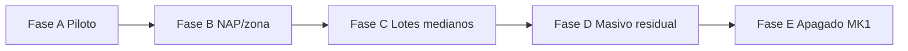

# Plan de migración de clientes — CCR1 (MK1) → CCR2 (MK2)

> **Estado:** plan operativo (sin ejecución en prod)  
> **Fecha:** 2026-07-20  
> **Hub:** [infra-red-multi-mikrotik-gigafiber.md](./infra-red-multi-mikrotik-gigafiber.md)  
> **Plan Cursor relacionado:** `.cursor/plans/multi_mikrotik_gigafiber_a973760c.plan.md` (fases 1–2 uplink/piloto; este doc cubre migración masiva)

---

## 1. Objetivos y criterios de éxito

### Objetivo

Mover abonados existentes que hoy salen por **MK1** (`network_device.id=1`, `38.224.231.2`, VLAN **1**, uplink OLT **0/3/3**) hacia **MK2** (`network_device.id=8`, `38.224.231.4`, VLAN **100**, uplink OLT **0/3/2**), de forma controlada por oleadas, con rollback por lote.

### Criterios de éxito (por cliente migrado)

| # | Criterio | Evidencia |
|---|----------|-----------|
| 1 | Tráfico L2 sale por VLAN 100 → uplink **0/3/2** | OLT: `display service-port …` → `vlan 100` / `user-vlan 100`; `display vlan 100` incluye el puerto GPON del abonado |
| 2 | L3 hacia gateway MK2 | MK2: ping a IP nueva del abonado; ARP `reachable` en `sfp-sfpplus2` |
| 3 | Internet desde CPE / LAN | Torch/conntrack en MK2 con destinos externos; prueba usuario (navegador / ping `8.8.8.8`) |
| 4 | Queue simple en **CCR2** | `/queue/simple/print where target=<ip>/32` en MK2; **ausente** en MK1 |
| 5 | Backend coherente | `subscription.host_device_id=8`, `ip` en pool MK2, `ip_pool_id` del pool MK2 |
| 6 | Sin degradación del parque residual en MK1 | ONUs VLAN 1 / 0/3/3 sin cambios no migrados |

### Downtime

| Escenario | Expectativa |
|-----------|-------------|
| Ventana por cliente | **2–15 min** típicos (OLT service-port + reconfig CPE + queue); pico mayor si hay visita a domicilio |
| Objetivo lote | ≤ **5%** de fallos por oleada; rollback del lote si se supera |
| Zero-downtime absoluto | **No garantizado** — el cambio de VLAN + IP WAN implica corte corto |

### Criterio de cierre de migración global (supuesto)

- ≥ **95%** de suscripciones FIBER activas con `host_device_id=1` migradas a `8`, o decisión explícita de dejar un residual en MK1.
- MK1 puede apagarse / deshabilitarse solo tras umbral acordado (ver §10).

---

## 2. Prerrequisitos (gate antes de oleada 1+)

Marcar cada ítem antes de migrar clientes de producción (más allá del piloto).

| # | Prerrequisito | Estado doc (2026-07-20) | Notas |
|---|---------------|-------------------------|-------|
| P0 | Internet end-to-end desde CPE piloto | ⏳ **Pendiente** | L3 OK (`192.168.30.202` ↔ MK2); torch no vio tráfico a Internet. Ver [olt-vlan100-mk2-uplink.md](./olt-vlan100-mk2-uplink.md) |
| P1 | Queue backend en `hostDevice id=8` para al menos 1 abonado | ⏳ Pendiente | Validar API ROS 7 (`/queue/simple/add`) |
| P2 | NAT masquerade MK2 WAN operativo | ✅ | Documentado en hub |
| P3 | Firewall forward/input en `sfp-sfpplus2` | ✅ | Piloto |
| P4 | DNS usable en CPE (p. ej. `8.8.8.8` / `1.1.1.1`) | ⏳ Validar en piloto | Backend no provisiona DNS al CPE |
| P5 | Perfiles OLT VLAN 100 (`PILOT_VLAN100` id 100) o perfil de producción equivalente | ✅ piloto | Escalar a perfiles estables antes de masivo |
| P6 | Capacidad pool VLAN100 MK2 | ✅ **Ampliado 2026-09-05** | Pools elegibles `192.168.30.1/24` + `192.168.31.1/24` (~482 IPs). Ver `mk2-pool-31-prod-2026-09-05.md`. Parque ~759 aún puede requerir más `/24` en oleadas grandes |
| P7 | Capacidad uplink OLT **0/3/2** (10G) y CPU/NAT MK2 | ⏳ Medir bajo carga | No hay baseline documentado de Mbps/abonados |
| P8 | Seeds prod: `vlan_id`, `disabled`, `ip_pool` MK2 | ✅ según hub (2026-07-20) | Solo CCR2 elegible para altas |
| P9 | Mapeo NAP → VLAN/hostDevice (negocio) | ❌ Pendiente | `NapBox` aún **sin** `vlanId` / `hostDeviceId` |
| P10 | Address-list `deudores` + cortes en MK2 | ⏳ Validar ROS 7 | `AddressListManagerService` agrupa por `hostDevice` — OK multi-MK si IPs/host estánados |
| P11 | Runbook rollback ensayado en 1–3 clientes | ❌ | Obligatorio antes de oleada NAP |

**Bloqueo duro:** no iniciar oleadas de producción sin **P0 + P1 + P6 (capacidad del lote)** + **P11**.

---

## 3. Inventario a migrar

### Fuentes de verdad

| Fuente | Qué aporta |
|--------|------------|
| MySQL `subscription` + `host_device_id` | Quién está en MK1 vs MK2 |
| `subscription.ip` / `ip_pool_id` | IP actual y pool |
| `napbox` + `place` / `mufa` | Agrupar por NAP/zona |
| `onu` (`fiber_onu`) | SN, board, port OLT |
| OLT | Service-port VLAN real (puede desalinearse de DB) |
| MK1 `/queue/simple` | Queues legacy por IP |

### Columnas relevantes (evidencia código)

| Entidad | Campos |
|---------|--------|
| `Subscription` | `hostDevice` → FK `host_device_id` (JPA `@OneToOne` sin `@JoinColumn` explícito → convención Hibernate `host_device_id`), `ip`, `ipPool`, `napBox`, `fiberOnu`, `serviceStatus`, `installationType` |
| `IpPool` | `ip_segment`, `host_device_id`, `is_eligible` |
| `NetworkDevice` | `vlan_id`, `disabled`, tipo `CLOUD_CORE_ROUTER` |
| `NapBox` | `code`, `place`, `oltBoard`/`oltPort` — **sin** vlan/hostDevice aún |

### Queries SQL sugeridas (solo lectura)

```sql
-- Conteo por core
SELECT s.host_device_id, nd.name, nd.ip_address, nd.vlan_id, nd.disabled,
       COUNT(*) AS total,
       SUM(s.service_status = 'ACTIVE') AS activas,
       SUM(s.service_status = 'CANCELLED') AS canceladas
FROM subscription s
LEFT JOIN network_device nd ON nd.id = s.host_device_id
GROUP BY s.host_device_id, nd.name, nd.ip_address, nd.vlan_id, nd.disabled;

-- Candidatos MK1 (activos fibra internet)
-- Enums InstallationType: FIBER, WIRELESS, ONLY_TV_FIBER
SELECT COUNT(*) AS candidatos_mk1
FROM subscription s
WHERE s.host_device_id = 1
  AND s.service_status = 'ACTIVE'
  AND s.installation_type = 'FIBER';

-- Por NAP / lugar
SELECT nb.id AS nap_id, nb.code, p.name AS place,
       COUNT(*) AS clients
FROM subscription s
JOIN nap_box nb ON nb.id = s.napbox_id
LEFT JOIN place p ON p.id = nb.place_id
WHERE s.host_device_id = 1
  AND s.service_status = 'ACTIVE'
GROUP BY nb.id, nb.code, p.name
ORDER BY clients DESC;

-- IPs y pools actuales MK1
-- Onu PK = sn → FK Hibernate típica: fiber_onu_sn (confirmar con SHOW CREATE TABLE)
SELECT s.id, s.first_name, s.last_name, s.ip, s.ip_pool_id, ip.ip_segment,
       o.sn, o.board, o.port, o.olt_id, nb.code AS nap
FROM subscription s
LEFT JOIN ip_pool ip ON ip.id = s.ip_pool_id
LEFT JOIN onu o ON o.sn = s.fiber_onu_sn
LEFT JOIN nap_box nb ON nb.id = s.napbox_id
WHERE s.host_device_id = 1
  AND s.service_status = 'ACTIVE'
ORDER BY nb.code, s.id;

-- Capacidad libre pool MK2 (hosts 10–250 según getFreeIp)
SELECT ip.id, ip.ip_segment, ip.is_eligible,
       (SELECT COUNT(*) FROM subscription s WHERE s.ip_pool_id = ip.id) AS usados
FROM ip_pool ip
WHERE ip.host_device_id = 8;
```

**Supuesto:** la FK a `onu` en prod suele ser `fiber_onu_sn` (PK de `Onu` = `sn`); validar con `SHOW CREATE TABLE subscription` antes de automatizar. Nombres de tabla (`nap_box` vs `napbox`) también pueden diferir por naming Hibernate.

### Capacidad pool — cálculo crítico

| Concepto | Valor |
|----------|-------|
| Pool MK2 actual | `192.168.30.1/24` (`ip_pool.id=8`) |
| Hosts asignables por backend | **10–250** inclusive → **241** |
| Parque ONUs documentado | **~759** en VLAN 1 |
| Conclusión | **Un solo /24 no alcanza** para migración total; planificar pools adicionales en MK2 (`192.168.31.1/24`, …) **o** ampliar máscara en router + backend |

`getFreeIp()` hoy toma **todos** los pools `is_eligible=1` **sin filtrar por `hostDevice`**. Con solo el pool MK2 elegible (seed aplicado), las altas nuevas ya van a `192.168.30.x`. Para migración masiva hay que:

1. Crear pools MK2 adicionales elegibles, **o**
2. Extender lógica para asignar IP del pool del `hostDevice` destino (gap de producto).

---

## 4. Estrategia de oleadas



| Fase | Alcance | Tamaño lote sugerido | Rollback |
|------|---------|----------------------|----------|
| **A — Piloto cerrado** | 1–5 abonados (incl. `ZTEG-DC47C169` + 1–2 reales) | 1 a la vez | Revertir OLT+CPE+DB+queues en &lt;30 min |
| **B — NAP piloto** | 1 NAP completo (menor primero) | Todo el NAP (típic. &lt;16–32) | Restaurar VLAN 1 + IP vieja + queue MK1 |
| **C — Zona / mufa** | Varios NAPs de una zona | **10–25**/ventana | Parar oleada; rollback fallidos; no avanzar |
| **D — Masivo** | Resto MK1 | **25–50**/ventana (subir solo si tasa éxito ≥95%) | Igual; congelar si fallos &gt;5% |
| **E — Cierre MK1** | Residual + descomisión | N/A | Solo si residual = 0 o aceptado |

### Reglas de oleada

1. Migrar por **NAP** (mismo splitter / misma lógica de visita técnica), no al azar.
2. Preferir horarios de **bajo uso** (madrugada / mañana temprano).
3. No mezclar en el mismo lote clientes con CPE distintos sin checklist CPE (router vs bridge, VLAN tagged).
4. Tras cada lote: checklist §8 completo antes del siguiente.
5. Mantener MK1 encendido y con queues residuales hasta fase E.

### Criterio de avance entre fases

| De → A | Condición |
|--------|-----------|
| A → B | Internet OK en piloto + queue MK2 + rollback ensayado |
| B → C | NAP piloto estable ≥ **48 h** sin incidentes |
| C → D | ≥ **2 zonas** estables; pools MK2 con holgura ≥ **20%** del restante |
| D → E | Residual documentado; cortes/deudores solo en MK2; tráfico MK1 ≈ 0 |

---

## 5. Pasos técnicos por cliente / lote

Orden recomendado (minimiza “IP huérfana” y doble NAT accidental):

### 5.1 Preparación (pre-corte)

1. Inventariar: `subscription_id`, IP actual, SN ONU, board/port/ont-id, NAP, plan (velocidades queue).
2. Reservar **IP nueva** en pool MK2 (fuera de 10–250 usados; evitar `.1` gateway, `.202` piloto).
3. Confirmar perfiles OLT VLAN 100 disponibles en ese puerto GPON.
4. Avisar al cliente (ventana).

### 5.2 OLT (L2)

Objetivo: service-port en **vlan 100** con **user-vlan 100** (CPE tagged), tráfico hacia **0/3/2**.

Pasos típicos (manual / expect; **no hay endpoint “change vlan”** en OLT Gateway hoy):

1. Identificar service-port actual (`display service-port port 0/{board}/{port} ont {ontId}`).
2. `undo service-port {index}` del vlan 1 (o el que corresponda).
3. Ajustar line/srv profile a VLAN 100 si el GEM mapping lo exige (piloto: `PILOT_VLAN100` profile-id **100**; `ont port native-vlan … vlan 100` si aplica).
4. Crear service-port:

```text
service-port vlan 100 gpon 0/{board}/{port} ont {ontId} gemport 1 multi-service user-vlan 100 tag-transform translate …
```

5. Verificar: ONU online, service-port up, óptica aceptable.

**Evidencia código:** `OltGatewayCommandService.authorize` crea service-port con `vlan` = `user-vlan` al **alta**, no al migrar. Para migración: script expect / CLI / futuro endpoint `modify-vlan` (gap).

**Riesgo:** ONUs legacy con **user-vlan 1** / untagged en CPE requieren alinear CPE **antes o en la misma ventana**; si el CPE no etiqueta 100, L2 falla.

### 5.3 MikroTik

| Acción | MK1 (origen) | MK2 (destino) |
|--------|--------------|---------------|
| Queue | `/queue/simple/remove` por `target=<ip_vieja>/32` | `/queue/simple/add` con IP **nueva** y límites del plan |
| ARP | Opcional: limpiar ARP viejo | Esperar ARP de IP nueva |
| Address-list `deudores` | Quitar IP vieja si estaba | Regenerar / agregar IP nueva si deudor |
| NAT | No tocar | Usar masquerade WAN existente |

Backend útil:

- `QueueManagerService.recreateQueueForSubscription(connection, subscription)` — opera sobre la conexión del `hostDevice` **actual** de la entidad.
- Por tanto: actualizar DB/`hostDevice` **antes** de recrear queue en MK2, o ejecutar API directa en ambos routers en la ventana.

**Gap:** `createSubscriptionsSimpleQueue()` usa el `hostDevice` de la **primera** suscripción activa para **todas** — no usar ese endpoint en escenario multi-MK hasta corregirlo.

### 5.4 Backend / DB

Campos a actualizar por suscripción:

| Campo | Valor destino |
|-------|---------------|
| `host_device_id` | **8** |
| `ip` | Nueva IP pool MK2 (única) |
| `ip_pool_id` | Pool MK2 correspondiente (`8` u otros creados) |

**Evidencia:**

- `updateSubscription()` puede cambiar `hostDevice` pero **no** reasigna `ip` / `ipPool`.
- No existe endpoint de “migración CCR1→CCR2”.
- `getFreeIp()` no recibe `hostDeviceId`.

Opciones operativas:

1. **SQL controlado + API queues** (documentar cada cambio; preferible con script idempotente).
2. **Endpoint futuro** `POST /subscription/{id}/migrate-core` (TDD): asigna IP pool del core destino, actualiza DB, mueve queues, opcionalmente dispara pasos OLT.

No cambiar `network_device.disabled` de MK1 hasta fase E (MK1 sigue sirviendo residual).

### 5.5 CPE (WAN)

| Hecho | Evidencia |
|-------|-----------|
| Backend **no** configura WAN del CPE en alta fibra | `FiberInstallationStrategy` solo authorize OLT + queue MK |
| TR-069 / ACS | Campo SmartOLT `tr069*` existe; ejemplos documentan `mgmt/tr069=Inactive`, `wan=Setup via ONU webpage`. **No inventar capacidad TR-069 operativa** |
| Acción | Reconfig **manual** en UI CPE (o OMCI si el modelo/perfil lo permite y está probado): IP, máscara, GW `192.168.30.1` (o GW del pool), DNS, **VLAN WAN 100 tagged**, modo **Router** |

Sin visita / acceso remoto al CPE, la migración L2/L3 MK2 queda a medias (síntoma piloto: solo ping al gateway).

### 5.6 Secuencia mínima por cliente (checklist corto)

```text
[ ] IP nueva reservada
[ ] OLT: service-port → vlan/user-vlan 100
[ ] CPE: WAN IP/GW/DNS/VLAN 100 / Router
[ ] DB: host_device=8, ip, ip_pool
[ ] MK2: queue add
[ ] MK1: queue remove (IP vieja)
[ ] Validar §8
[ ] Si falla → rollback §4
```

---

## 6. Automatización posible vs manual

| Paso | Automatizable hoy | Cómo | Gap |
|------|-------------------|------|-----|
| Inventario SQL | ✅ | Queries §3 | — |
| Alta ONU nueva VLAN 100 | ✅ parcial | `FiberInstallationStrategy` + `vlanId` del hostDevice; scripts `olt-onu-pilot-mk2-authorize.expect` | NapBox→VLAN pendiente |
| Cambio VLAN service-port existente | ⚠️ manual / expect | CLI OLT; no API migrate-vlan | Endpoint + parser |
| Asignar IP pool por core | ✅ | `SubscriptionIpAllocationService.allocateFreeIp(hostDeviceId)` | Seed `nap_box.host_device_id` |
| Actualizar hostDevice+IP en DB | ⚠️ manual / SQL | Sin endpoint migración | Feature TDD |
| Queue create/recreate | ✅ | `QueueManagerService` + API ROS | Validar ROS 7 en masa; fix bulk queue |
| Address-list deudores | ✅ | Agrupa por `hostDevice` | Probar en MK2 |
| Config WAN CPE | ❌ | Manual / OMCI puntual | TR-069 **no operativo** |
| Rollback lote | ⚠️ semi | Scripts inversos OLT+MK+SQL | Empaquetar runbook |

### Scripts existentes útiles

| Script | Uso en migración |
|--------|------------------|
| `scripts/olt-onu-pilot-mk2-authorize.expect` | Referencia alta VLAN 100 |
| `scripts/olt-vlan100-uplink.expect` | **No** usar en migración de clientes (solo uplink) |
| `scripts/mikrotik-mk2-pilot-verify.sh` | Validación L3 post-lote |
| `scripts/mikrotik-mk2-phase1-verify.py` | Salud API MK2 |
| `scripts/sql/ip-pool-mk2-vlan100-seed.sql` | Pool base MK2 |

### Endpoints backend relevantes

| Endpoint / servicio | Rol |
|---------------------|-----|
| `GET .../networkDevice/connection/{id}/system-info` | Salud MK1/MK2 |
| `POST .../subscription/generate-simple-queues` | **Evitar** en multi-MK hasta fix |
| `QueueManagerService` / cortes / address-list | Operan por `subscription.hostDevice` |
| OLT Gateway authorize/move/delete/reboot | Sin “change vlan” in-place |

---

## 7. Riesgos

| Riesgo | Impacto | Mitigación |
|--------|---------|------------|
| Agotamiento pool `/24` (~241 IPs) | Parada de oleadas / altas | Ampliar pools MK2 **antes** de fase C/D |
| CPE sin VLAN 100 / modo bridge | Sin Internet pese a L2 OK | Checklist CPE; torch; no cerrar ticket sin prueba externa |
| Doble NAT / IP vieja aún con queue MK1 | Rutas raras, cortes mal aplicados | Quitar queue MK1; una sola IP activa en DB |
| Clientes VLAN 1 untagged | Service-port user-vlan 100 rompe | Clasificar CPE; migrar con visita |
| Tocar uplink **0/3/3** | Outage masivo MK1 | **Prohibido** durante migración |
| ROS 7 vs ROS 6 (queues/address-list) | Fallos API | Piloto P1; no masivo sin validación |
| `getFreeIp` sin filtro por core | IP de pool incorrecto si se re-elegibilizan pools MK1 | Mantener pools MK1 `is_eligible=0` |
| Bulk `generate-simple-queues` | Queues en router equivocado | No usar; recrear por `hostDevice` |
| Downtime + visita técnica | Costo operativo | Oleadas por NAP; comunicar ventana |
| Desalineación DB ↔ OLT | Soporte confuso | Reconciliar SN/service-port por lote |
| Rollback incompleto | Cliente offline | Ensayo P11; checklist inverso |

---

## 8. Checklist de validación post-migración

Por cada cliente (o muestra ≥20% en lotes grandes):

### OLT

- [ ] `display ont info by-sn …` → online
- [ ] `display service-port …` → vlan **100**, user-vlan **100**, up
- [ ] `display ont optical-info …` → Rx/Tx en rango aceptable

### MikroTik MK2

- [ ] `/ping <ip_nueva> count=5` OK
- [ ] `/ip arp print where address=<ip_nueva>` → `reachable` en `sfp-sfpplus2`
- [ ] `/queue/simple/print where target=<ip_nueva>/32` → límites del plan
- [ ] Torch/conntrack: tráfico a destinos externos durante prueba usuario

### MikroTik MK1

- [ ] No queda queue con `target=<ip_vieja>` ni `<ip_nueva>`
- [ ] Address-list sin IP vieja si aplica

### Backend

- [ ] `host_device_id = 8`
- [ ] `ip` / `ip_pool_id` coherentes con MK2
- [ ] (Si deudor) corte/reactivación actúa sobre MK2

### Usuario

- [ ] Navegación / DNS OK desde LAN
- [ ] Velocidad razonable vs plan (smoke)

---

## 9. Cronograma tentativo por fases

Sin fechas rígidas (depende de P0, visitas CPE y ampliación de pools).

| Fase | Contenido | Dependencias | Salida |
|------|-----------|--------------|--------|
| **0 — Cierre piloto** | Internet CPE + queue MK2 + doc lecciones | Piloto actual | Gate P0/P1 |
| **1 — Capacidad** | Diseñar/crear pools MK2 adicionales; DNS/NAT revisados | Fase 0 | Holgura IP para oleadas |
| **2 — Runbook + tools** | Scripts expect migrate-vlan; SQL de reserva IP; (opcional) endpoint migrate-core | Fase 1 | P11 ensayado |
| **3 — Oleada A** | 1–5 clientes | Fase 2 | Métricas downtime/fallos |
| **4 — Oleada B** | 1 NAP | Estabilidad A ≥48 h | NAP 100% en MK2 |
| **5 — Oleadas C** | Zona por zona | Mapeo NAP negocio | % MK1 decreciente |
| **6 — Oleada D** | Residual masivo | Pools OK; tasa éxito | &lt;5% en MK1 o residual aceptado |
| **7 — Fase E** | Descomisión MK1 / `disabled=true` id=1; documentar | Tráfico MK1 ~0 | Solo MK2 en producción |

Paralelo recomendado (no bloquea oleadas pequeñas): `NapBox.vlanId` / `hostDeviceId` para altas nuevas por zona ([plan Cursor](../.cursor/plans/multi_mikrotik_gigafiber_a973760c.plan.md) fase 3).

---

## 10. Qué NO hacer todavía

1. **No apagar ni deshabilitar MK1** (`id=1`) hasta migrar el umbral acordado (sugerido ≥95% o residual documentado).
2. **No tocar OLT 0/3/3** ni quitar VLAN 1 del uplink legacy.
3. **No migrar en bloque las ~759 ONUs** en una sola ventana.
4. **No asumir TR-069** para reconfigurar WAN (no está operativo; CPE = manual/OMCI probado).
5. **No re-marcar elegibles los pools MK1** mientras `getFreeIp()` no filtre por core.
6. **No usar** `POST /subscription/generate-simple-queues` en multi-MK sin corregir el bug del primer `hostDevice`.
7. **No avanzar a fase C/D** sin ampliación de pools (un `/24` no basta).
8. **No cerrar** el piloto como “listo” solo con ping al gateway (hace falta Internet real).
9. **No cambiar** native-vlan del uplink 0/3/2 durante oleadas.
10. **No migrar** sin inventario OLT (board/port/ont) verificable — adivinar posición GPON genera outages largos.

---

## 11. Rollback por cliente (resumen)

1. OLT: `undo service-port` vlan 100 → recrear vlan **1** / user-vlan original.
2. CPE: restaurar IP/GW/VLAN anteriores.
3. DB: `host_device_id=1`, `ip` e `ip_pool_id` anteriores.
4. MK1: recrear queue; MK2: borrar queue IP nueva.
5. Validar Internet por path legacy.

---

## 12. Referencias

| Doc | Rol |
|-----|-----|
| [infra-red-multi-mikrotik-gigafiber.md](./infra-red-multi-mikrotik-gigafiber.md) | Hub arquitectura |
| [mikrotik-routers-inventario.md](./mikrotik-routers-inventario.md) | IDs / IPs / disabled |
| [olt-vlan100-mk2-uplink.md](./olt-vlan100-mk2-uplink.md) | VLAN 100 + ONU piloto |
| [mikrotik-mk2-config-olt-uplink.md](./mikrotik-mk2-config-olt-uplink.md) | Gateway MK2 |
| [mikrotik-mk2-comandos-catalogo.md](./mikrotik-mk2-comandos-catalogo.md) | Comandos ROS diagnóstico |
| [olt-gateway-comandos-catalogo.md](./olt-gateway-comandos-catalogo.md) | Catálogo CLI OLT |
| [smartolt-onu-data-model.md](./smartolt-onu-data-model.md) | WAN vía webpage; TR069 inactive (ejemplo) |

### Código clave

| Pieza | Ruta |
|-------|------|
| VLAN desde hostDevice | `FiberInstallationStrategy.resolveVlan` |
| Asignación IP | `SubscriptionService.getFreeIp` |
| Queues | `QueueManagerService` |
| Authorize OLT | `OltGatewayCommandService.authorize` |
| Deudores multi-device | `AddressListManagerService` |

---

## 13. Supuestos explícitos

1. El conteo **759 ONUs** del hub sigue siendo la orden de magnitud del parque VLAN 1; el inventario exacto se obtiene con las SQL de §3 en prod.
2. La mayoría de abonados usan IP estática en CPE (no PPPoE en MK2 piloto).
3. Los CPE migrados deberán usar **VLAN 100 tagged** como el piloto ZTE; si hay parque untagged, requiere procedimiento distinto (no detallado hasta inventariar modelos).
4. La migración masiva es **operativa + scripts**, no un botón de producto, hasta que exista endpoint dedicado.
5. Ampliar pools MK2 es decisión de ingeniería de red (direcciónes `192.168.3x.0/24` libres) — no fijada en este plan.
