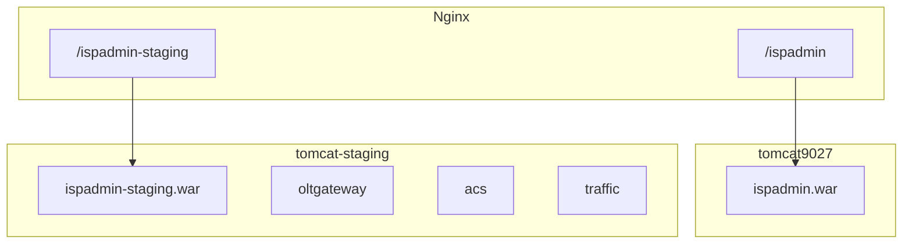

# Staging Tomcat aislado + WAR selectivo (2026-09-05)

`--env staging` ya no comparte JVM con producción. Los artefactos staging van a **`tomcat-staging`** (host **8081**). Un deploy parcial sube solo los WAR del set (`--only` o mapa git).

Tests: `DeployEnvScriptTest`, `DeploySelectWarsScriptTest`, `DeployStagingIsolationScriptsTest`.

## Aislamiento

| | Prod | Staging |
|--|------|---------|
| Compose | `tomcat` → `tomcat9027` | `tomcat-staging` → `tomcat-staging` |
| Host | `127.0.0.1:8080` | `127.0.0.1:8081` |
| Nginx | `gigafiber_backend` | `gigafiber_backend_staging` |
| WARs | `ispadmin.war` | `ispadmin-staging*.war` |

`--env staging` no ejecuta `docker compose up -d tomcat`, no hace `rm`/`docker cp` de `ispadmin.war` y no parchea volúmenes del servicio `tomcat`.

Dentro de `tomcat-staging`, Core→Gateway/ACS/Traffic sigue en `http://127.0.0.1:8080/ispadmin-staging-*` (mismo contenedor). Scripts en el **host** VPS que peguen a staging usan **8081** (p. ej. `tr069-e2e-hard-cleanup.sh`).



Alta del servicio (idempotente): `scripts/ensure-tomcat-staging-compose.py` + `docker compose up -d tomcat-staging`. Nginx: `scripts/rewrite-nginx-staging-upstream.py`.

Tras el primer deploy OK a `tomcat-staging`, quitar a mano `ispadmin-staging*.war` de `tomcat9027` para que dejen de cargar en la JVM de prod.

## WAR selectivo

```bash
./scripts/deploy.sh --deploy --env staging --with oltgateway,traffic,acs --only oltgateway
```

`--only` gana siempre. Sin flag: `git diff --name-only HEAD`. Working tree limpio o solo docs → error pidiendo `--only`.

| Rutas | WAR |
|-------|-----|
| `**/oltgateway/**`, `application-oltgateway.properties` | Gateway |
| `**/acs/**`, `application-acs.properties` | ACS |
| `**/traffic/**`, `application-traffic.properties` | Traffic |
| `**/wispadmin/**`, observability/netdiag/servicehealth, `application-staging.properties` | Core |
| `**/events/**`, `pom.xml`, `application-prod.properties`, `application.properties` | los 4 |

`--with` no elige artefactos: solo activa clientes HTTP al empaquetar Core.

`run_rsync` usa `-t`. Tras `sync_war_to_host`, `deploy_*` hace `docker cp` desde `/opt/gigafiber/<war>` (un upload).

Prod sigue un solo WAR Core.

## Referencias

- Flujo operativo: [deploy-flow.md](./deploy-flow.md)
- Tamaños WAR: [wars-adelgazados-models-fs.md](./wars-adelgazados-models-fs.md)
- Incidente JVM compartida: [restore-prod-war-staging-recreate-2026-09-03.md](./restore-prod-war-staging-recreate-2026-09-03.md)
