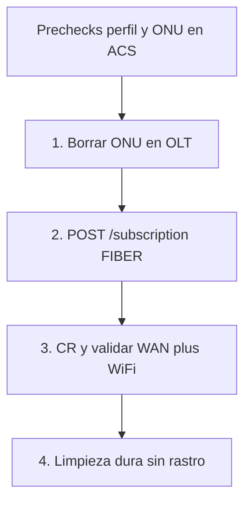

# E2E TR-069 — validación de modelo ONU

Runbook **genérico** para comprobar que un modelo de ONU (perfil importado en `tr069_model_profile`) se aprovisiona bien por el backend. No es un test de CI ni un alta de cliente real.

Flujo obligatorio:

1. Eliminar la ONU de la OLT.
2. Registro de prueba FIBER con `POST /subscription`.
3. Connection Request (CR) y validar WAN (IP del pool) + WiFi.
4. Limpieza dura: sin rastro en OLT, MikroTik, MySQL (incl. logs) ni cola ACS.



Relacionado: [genieacs-despliegue-gigafiber.md](./genieacs-despliegue-gigafiber.md), [mk2-red-aprovisionamiento-255.md](./mk2-red-aprovisionamiento-255.md), [olt-gateway-comandos-catalogo.md](./olt-gateway-comandos-catalogo.md), [reuso-onu-cancelada.md](./reuso-onu-cancelada.md), [tr069-huawei-spv-aislado-l3.md](./tr069-huawei-spv-aislado-l3.md) (WAN `Connected` sin Internet: NAT/DNS/máscara).

---

## Prechecks

Antes del paso 1:

| Chequeo | Cómo |
|---------|------|
| Perfil TR-069 | Fila en `stg_acs`/`prod_acs.tr069_model_profile` (ACS WAR) cuyo `product_class` o `aliases_json` coincida con el `onu_type_name` del alta y/o el `_ProductClass` GenieACS. El registry acepta contains (p. ej. `F6600RV9.0.21` resuelve `F6600R`). **F6600R:** `client_wan_ip_connection_path` = `...WANDevice.1.WCD.1.WANIPConnection.2` (re-import CSV). **VSOL/HG8145X6:** esa columna NULL (WCD.2; Huawei live 2026-08-25). Gobierno: [tr069-perfiles-gobierno-acs.md](./tr069-perfiles-gobierno-acs.md). |
| ACS | `GENIEACS_ENABLED=true` en Tomcat. El CPE informa; WAN de fábrica/staging es **WCD.1** en `192.168.255.0/24` (no tocar ese slot). |
| NBI | Túnel `127.0.0.1:7557` o NBI Docker. Device id típico: `{OUI}-{ProductClass}-{Serial}`. |
| Pool IP | Pool **habilitado**, alineado con `hostDeviceId` + `vlan` del JSON. No enviar `clientIpAddress`: [IpAllocationService](../src/main/kotlin/com/dscorp/wispadmin/wispadmin/service/IpAllocationService.kt) asigna una IP libre. |
| Timeout | `POST /subscription` aplica TR-069 **fuera de TX** y puede esperar ~90 s (`genieacs.wait-timeout-ms`). GenieACS NBI suele devolver **HTTP 202** al encolar el provision: el ACS no debe persistir `PENDING` por eso; espera GPV IP `10.64.*` + SSIDs. |
| Auth | `/subscription*` → `Authorization: Bearer` (login `/users/login`). OLT (pasos 1 y 4) → **SmartOLT cloud** `X-Token` (`olt.service.api-key`). |

**No usar `POST /subscription/{id}/cancel` como limpieza.** `cancelService` deja la ONU autorizada en OLT, mete la IP en address-list `deudores` y deja la fila `CANCELLED`. Ver paso 4.

Si ya existe una suscripción de prueba con el mismo SN, ejecutar el paso 4 **antes** del 1. Si no: `sn_already_exists` o el reuse de canceladas ([CancelledOnuReuseService](../src/main/kotlin/com/dscorp/wispadmin/wispadmin/service/CancelledOnuReuseService.kt)).

Base HTTP (prod): `https://api.gigafiberperu.cloud/ispadmin`.

---

## Post-deploy F6600R (Flyway V29)

El e2e F6600R **requiere** backend desplegado y re-import del perfil. `WANDevice.2` es dongle 3G (CWMP **9002**). AddObject `WANDevice.1.WCD.2` también **9002**. El camino validado en ACS es `WANIPConnection.2` en el mismo WCD de staging.

1. Deploy WAR; Flyway aplica `client_wan_ip_connection_path` / `client_vlan_parameters_json`.
2. Confirmar VSOL/Huawei: `SELECT product_class, client_wan_ip_connection_path FROM tr069_model_profile;` — VSOL debe seguir **NULL**.
3. Re-import **solo** F6600R (conservar aliases `F6600`, `F6600RV9.0.21`):

```bash
# CSV: src/test/resources/genieacs-exports/zte-f6600r.csv (o export fresco del C838)
curl -sS -X POST "$API/admin/tr069-profiles/import" \
  -H "Authorization: Bearer $TOKEN" \
  -F "file=@zte-f6600r.csv" \
  -F "aliases=F6600,F6600RV9.0.21"
```

4. El JSON de respuesta debe incluir `clientWanIpConnectionPath` con `WANDevice.1.WANConnectionDevice.1.WANIPConnection.2`.

---

## Lab HG8145X6 WAN (NBI, 2026-08-25)

Live ACS **sin** import backend. Device `00259E-HG8145X6-48575443C6FBA6AA` · SN `48575443C6FBA6AA` · FW `V5R021C10S165`.

| Slot | Rol | Resultado |
|------|-----|-----------|
| WCD.1 WANIP.1 | Staging TR-069 | **No tocar.** `192.168.255.245` DHCP · VLAN 100 · `X_HW_SERVICELIST=TR069` · NAT off · LANBIND todo `0` · CR `http://192.168.255.245:7547/...` · `Connected` |
| WCD.2 WANIP.1 | Internet abonado | AddObject WCD crea índice **2**. AddObject `...WCD.2.WANIPConnection`. SPV Static `192.168.30.250` → GPV `Connected` |

**Un Connection Request (validado 2026-08-25, segunda pasada):** `deleteObject` WCD.2 (CR aparte, reset de lab) → encolar sin CR AddObject WCD + AddObject `...WCD.2.WANIPConnection` (HTTP 202) → un SPV **con** `connection_request` (WAN + LANBIND, HTTP 200, ~10 s). Huawei usa el WCD recién creado **en la misma sesión**. No hace falta 9005 ni un segundo CR para el SPV.

SPV único (paths bajo `...WANConnectionDevice.2.WANIPConnection.1`):

- `Enable`, `ConnectionType=IP_Routed`, `ConnectionTrigger=AlwaysOn`, `Name=2_INTERNET_R_VID_100`
- `X_HW_SERVICELIST=INTERNET`, `NATEnabled=true`, `X_HW_IPv4Enable=true`
- `AddressingType=Static`, `ExternalIPAddress`, `SubnetMask=255.255.255.0`, `DefaultGateway=192.168.30.1`, `DNSServers=8.8.8.8,8.8.4.4`, `DNSEnabled=true`
- `X_HW_VLAN=100` (`xsd:unsignedInt`)
- `X_HW_LANBIND.Lan{1-4}Enable` y `SSID{1-4}Enable` = `1` (`xsd:unsignedInt`) — mismo SPV; sin LANBIND el HGU no enruta LAN/WiFi por la WAN cliente

Si el SPV mixto 9002 deja `NATEnabled=false`, DNS de fábrica o `SubnetMask` vacío: **no recrear WCD**. Reparar con [SPV aislado de L3](./tr069-huawei-spv-aislado-l3.md) (NAT → DNS → máscara, un CR cada uno). Lab 2026-08-25: las tres hojas persistieron; IPPing `8.8.8.8` 4/4; no hizo falta ciclo `Enable`. WiFi lab: 2.4 GHz `lab-hg8145-24` / `LabHg8145Wifi24!` · 5 GHz `lab-hg8145-5` / `LabHg8145Wifi5ghz!`.

GenieACS no admite AddObject+SPV en un solo objeto JSON. Un POST con **array** de las 3 tasks + `connection_request` responde HTTP **200** pero **no aplica en el CPE** (falso éxito: cola vacía, `refreshObject` deja solo WCD.1). El patrón que sí funciona: 2 POST 202 (AddObject) + 1 POST SPV con CR.

### Matriz de tiempos (2026-08-25, sin sleeps extra)

Protocolo: T_apply = primer POST de la estrategia → HTTP 200 del último SPV/create. T_ok = T_apply + GPV (`ExternalIPAddress=192.168.30.250`, `Connected`). `deleteObject` de reset no cuenta. Misma ONU, IP lab `192.168.30.250`.

| ID | Estrategia | T_apply | T_ok (con GPV) | Detalle de sesiones |
|----|------------|---------|----------------|---------------------|
| **S0** | 4 CR: refresh + AddObject WCD + AddObject WANIP + SPV | **17.7 s** | 19.2 s | refresh 6.2 s · addWCD 2.5 s · addWANIP 3.1 s · SPV 5.9 s |
| **S1** | 2 POST 202 + 1 SPV con CR | **11.4 s** | 13.4 s | cola 0.3+0.4 s · un CR 10.8 s |
| **S3** | Solo SPV (WCD.2 ya existía) | **2.1 s** | 3.7 s | re-alta / cambio de IP |
| **S4** | AddObject WANIP **con** CR + SPV con 2.º CR | **12.9 s** | 14.7 s | create 5.5 s + SPV 7.1 s |

Alta en frío (no hay WCD.2): gana **S1** (~6 s menos que S0, ~1.5 s menos que S4). El `refreshObject` del backend (~6 s) es el mayor extra evitable en S0. S3 es el piso si el slot cliente ya está. WCD.2 quedó restaurada tras S4.

**Backend (S1, 2026-08-25):** [Tr069ProvisioningService](../src/main/kotlin/com/dscorp/wispadmin/wispadmin/service/genieacs/Tr069ProvisioningService.kt) ya no duerme 5 s ni hace `refreshObject` en alta en frío. AddObject WCD + WANIP van **sin** CR (HTTP 202). VSOL/ZTE: un SPV WAN+WiFi **con** CR. Huawei: SPV WAN+LANBIND **sin** CR y WiFi (solo SSID/PSK) **con** CR; el CPE aplica ambos en esa sesión. `refreshObject` solo si WCD.2 ya está en caché ACS (slot fantasma). Si el GPV deja NAT off / máscara vacía / DNS `192.168.0.1`, un SPV L3 aislado: [tr069-huawei-spv-aislado-l3.md](./tr069-huawei-spv-aislado-l3.md).

**Import perfil:** el extractor deja `client_wan_ip_connection_path` NULL (WCD.2) y el builder Huawei escribe `X_HW_SERVICELIST` + LANBIND (no `X_ZTE-COM_*`). Falta el `POST /admin/tr069-profiles/import` del CSV `huawei-hg8145x6.csv` en prod.

**Fault `inform` 9002 Internal error:** el provision `inform` de GenieACS reaparece en cada Inform de esta ONU (`Device.ManagementServer.*` / passwords write-only). No bloquea CR (HTTP 200 en ~3–8 s). Purgar `/faults/{device}:inform` antes de encadenar AddObject/SPV para no mezclar retries.

WiFi aplicado en lab: 2.4 GHz `WLANConfiguration.1` (`lab-hg8145-24`) y 5 GHz `WLANConfiguration.5` (`lab-hg8145-5`). LANBIND solo ata `SSID1` (2.4 GHz).

---

## 1. Eliminar la ONU en la OLT

Objetivo: que el alta vuelva a `authorize_onu` (autofind / unconfigured).

**Opción A (recomendada — mismo camino que `POST /subscription`):** API **SmartOLT cloud**, vía [RealOltService](../src/main/kotlin/com/dscorp/wispadmin/wispadmin/service/RealOltService.kt).

```bash
SMARTOLT=https://gigafiberperu.smartolt.com/api
# olt.service.api-key en application-prod.properties (header X-Token)

# Resolver unique_external_id + slot/port/onu_type
curl -sS -H "X-Token: $SMARTOLT_API_KEY" \
  "$SMARTOLT/onu/get_onus_details_by_sn/{SN}"

# Borrar
curl -sS -X POST -H "X-Token: $SMARTOLT_API_KEY" \
  "$SMARTOLT/onu/delete/{unique_external_id}"

# Confirmar autofind (puede tardar unos segundos)
curl -sS -H "X-Token: $SMARTOLT_API_KEY" \
  "$SMARTOLT/onu/unconfigured_onus"
```

**Opción B (alternativa — SSH directo):** solo si `10.11.104.2:22` es alcanzable desde Tomcat. Endpoints `/api/olt-gateway/onu/...` con `X-Olt-Gateway-Key` → CLI `ont delete`. Ver [olt-gateway-comandos-catalogo.md](./olt-gateway-comandos-catalogo.md).

Si la opción A responde en ~1 s y la B hace timeout 60 s (`OltUnreachableException`), **usar A** para e2e y limpieza.

Criterio: el SN está en `unconfigured_onus` (o `display ont autofind` equivalente) y **no** en inventario autorizado.

El HGU puede seguir informando al ACS por WCD.1 (`192.168.255.x`) aunque la ONT ya no esté en la OLT de servicio.

---

## 2. Registro de prueba FIBER

`POST /subscription` ([SubscriptionController.newSubscription](../src/main/kotlin/com/dscorp/wispadmin/wispadmin/controller/SubscriptionController.kt)):

1. `registerSubscription` — IP del pool, authorize OLT ([FiberInstallationStrategy](../src/main/kotlin/com/dscorp/wispadmin/wispadmin/service/subscription/strategies/FiberInstallationStrategy.kt)), simple queue MK.
2. [Tr069PostInstallProvisioner.apply](../src/main/kotlin/com/dscorp/wispadmin/wispadmin/service/genieacs/Tr069PostInstallProvisioner.kt) — SPV WAN cliente + WiFi. **No modifica el slot de staging** (`WANDevice.1.WCD.1`).

   WAN cliente por modelo (opt-in en el perfil):

   | Modelo | Staging (no tocar) | WAN cliente (SPV + GPV) |
   |--------|--------------------|-------------------------|
   | VSOL | `WANDevice.1.WCD.1` | `WANDevice.1.WCD.2` (AddObject WCD si falta) |
   | Huawei HG8145X6 | `WANDevice.1.WCD.1` (`1_TR069_R_VID_100`) | `WANDevice.1.WCD.2.WANIP.1` (AddObject WCD **y** WANIP + SPV en **un** CR; validado NBI 2026-08-25) |
   | ZTE F6600R | `WANDevice.1.WCD.1.WANIP.1` (TR-069, no tocar) | `WANDevice.1.WCD.1.WANIP.2` (AddObject `WANIPConnection` en el mismo WCD) |

   Tras importar un CSV F6600R, verificar en BD: `client_wan_ip_connection_path` apunta a `InternetGatewayDevice.WANDevice.1.WANConnectionDevice.1.WANIPConnection.2`. Perfiles VSOL/Huawei: esa columna **NULL** (WCD.2). No enviar `X_CT-COM_ServiceList` en el F6600R. Huawei: no enviar `X_CT-COM_*` ni `X_ZTE-COM_*` (9005); VLAN/servicio = `X_HW_VLAN` / `X_HW_SERVICELIST`.

Esqueleto (placeholders; DNI/teléfono de laboratorio; `onu_type_name` = clave del perfil):

```json
{
  "firstName": "Prueba",
  "lastName": "Tr069",
  "dni": "00000000",
  "address": "lab",
  "phone": "51900000000",
  "subscriptionDate": 1774650000000,
  "planId": 0,
  "additionalDeviceIds": [],
  "placeId": 0,
  "location": { "latitude": -11.1, "longitude": -77.6 },
  "technicianId": 0,
  "napBoxId": 0,
  "hostDeviceId": 0,
  "installationType": "FIBER",
  "vlan": "100",
  "wifiSsid24": "lab-e2e-24",
  "wifiPassword24": "********",
  "wifiSsid5": "lab-e2e-5",
  "wifiPassword5": "********",
  "onu": {
    "sn": "{SN}",
    "olt_id": "2",
    "pon_type": "gpon",
    "board": "{slot}",
    "port": "{port}",
    "onu_type_id": "{smartolt onu_type_id}",
    "onu_type_name": "{F6600R|F6600RV9.0.21|HG8145X6|alias SmartOLT}"
  }
}
```

**No** incluir `"onu": ""` en el JSON del `onu`: Jackson devuelve **HTTP 400 vacío** al deserializar.

Token Bearer: login `/users/login` o token de sesión ADMIN (`accessToken` del `UserDto`).

```bash
curl -sS -X POST "$API/subscription" \
  -H "Authorization: Bearer $TOKEN" \
  -H "Content-Type: application/json" \
  --max-time 120 \
  -d @alta-e2e.json
```

**Sin `tr069ProvisionStatus=COMPLETE` la prueba no es exitosa.** OLT/MK en `COMPLETE` no basta: el backend debe confirmar IP + SSIDs **con el ACS** (GPV post-SPV).

Criterio de salida (`data` del `BaseResponse`):

- `id` de suscripción
- `ip` dentro del CIDR del pool (**no** `192.168.255.x`)
- `oltProvisionStatus` = `COMPLETE`
- `tr069ProvisionStatus` = **`COMPLETE`** (obligatorio)

Si TR-069 queda `MANUAL_REQUIRED` o `PENDING`, anotar `tr069LastError` / `GET /subscription/{id}/acs`, capturar el fault GenieACS de AddObject/SPV y **igual** ejecutar el paso 4. No dar el e2e por cerrado.

### Entregar WiFi al usuario (obligatorio si COMPLETE)

En cuanto el e2e esté en **`COMPLETE`** (GPV de IP + SSIDs OK), **antes** de la limpieza y **en el mismo mensaje de cierre**, dar al usuario las credenciales WiFi que se enviaron en el `POST /subscription`. No dar la prueba por cerrada si solo se mencionan los SSID.

El wrapper Espresso staging (`e2e_register_fiber_staging_espresso.sh`) imprime `wifi_24` / `wifi_5` (SSID + password) **antes** del hard cleanup. El post-cleanup lo decide `--cleanup-mode ask|auto|skip` (`auto` por defecto). Ver [e2e-cleanup-prompt.md](./e2e-cleanup-prompt.md) y [fix-e2e-wifi-log-antes-cleanup.md](./fix-e2e-wifi-log-antes-cleanup.md).

Incluir en una tabla:

| Banda | SSID | Contraseña |
|-------|------|------------|
| 2.4 GHz | valor de `wifiSsid24` | valor de `wifiPassword24` |
| 5 GHz | valor de `wifiSsid5` | valor de `wifiPassword5` |

Lab F6600R (C838) usado en la prueba exitosa 2026-08-25 (suscripción 2301):

| Banda | SSID | Contraseña |
|-------|------|------------|
| 2.4 GHz | `lab-zte-e2e-24` | `LabZteWifi24!` |
| 5 GHz | `lab-zte-e2e-5` | `LabZteWifi5ghz!` |

Si el alta usó otros valores, entregar **esos**, no los de la tabla de lab. Son claves de laboratorio en el HGU, no secretos de clientes reales.

---

## Logs temporales `DIAG_ALTA` (diagnóstico e2e)

Prefijo temporal en todo el cableado del alta FIBER (app → Core → Gateway → ACS → GenieACS). **Borrar** cuando el timeout TR-069 esté diagnosticado y corregido.

| Capa | Dónde | Qué grep |
|------|--------|----------|
| App | logcat tag `DIAG_ALTA` | `adb logcat -s DIAG_ALTA` |
| Core | `SubscriptionController`, `FiberInstallationStrategy`, `SubscriptionProvisionService`, `GatewayOnuActivationClient` | `docker exec tomcat-staging grep DIAG_ALTA logs/catalina.out` |
| Gateway | `OnuActivationService`, `HttpAcsCpeClient` | mismo `catalina.out` (WAR oltgateway) |
| ACS | `CpeFacadeService`, `NamedCpeProvisioner` | mismo `catalina.out` (WAR acs) |

No loguea passwords PPPoE ni WiFi. Grep: `DIAG_ALTA`.

---

## 3. CR y validación WAN / WiFi

El POST no sustituye una sesión ACS posterior. Forzar Connection Request y leer el CPE.

Device id GenieACS: el de `_id` en NBI (o `genieacsDeviceId` en `GET /subscription/{id}/acs`).

WLAN: usar los paths del perfil (`wlan24_path` / `wlan5_path`), no asumir índices VSOL invertidos.

WAN cliente (GPV) **por modelo**:

| Modelo | Path `ExternalIPAddress` | WiFi 2.4 / 5 |
|--------|--------------------------|--------------|
| VSOL | `InternetGatewayDevice.WANDevice.1.WANConnectionDevice.2.WANIPConnection.1` | `.WLANConfiguration.5` / `.1` |
| Huawei HG8145X6 | `InternetGatewayDevice.WANDevice.1.WANConnectionDevice.2.WANIPConnection.1` | `.WLANConfiguration.1` / `.5` |
| ZTE F6600R | `InternetGatewayDevice.WANDevice.1.WANConnectionDevice.1.WANIPConnection.2` | `.WLANConfiguration.1` / `.5` |

```bash
# F6600R (C838). VSOL: cambiar WAN a WANDevice.1.WCD.2 y SSIDs 5/1.
curl -sS -i -m 90 -X POST \
  "http://127.0.0.1:7557/devices/{deviceId}/tasks?timeout=60000&connection_request" \
  -H "Content-Type: application/json" \
  -d '{
    "name": "getParameterValues",
    "parameterNames": [
      "InternetGatewayDevice.WANDevice.1.WANConnectionDevice.1.WANIPConnection.2.ExternalIPAddress",
      "InternetGatewayDevice.WANDevice.1.WANConnectionDevice.1.WANIPConnection.2.X_ZTE-COM_VLANID",
      "InternetGatewayDevice.LANDevice.1.WLANConfiguration.1.SSID",
      "InternetGatewayDevice.LANDevice.1.WLANConfiguration.5.SSID"
    ]
  }'
```

Huawei: VLAN `X_HW_VLAN`; VSOL 2.4/5 GHz suele ser `WLANConfiguration.5` / `.1`. Tras HTTP **200** (no `202 Device is offline`), contrastar:

| Dato | Esperado |
|------|----------|
| `ExternalIPAddress` WAN cliente | = `subscription.ip` (pool), **no** `192.168.255.x` |
| SSIDs 2.4 / 5 | = `wifiSsid24` / `wifiSsid5` del alta |
| `GET /subscription/{id}/acs` | `provisionStatus=COMPLETE`, `wanIpCache`, `ssid24`, `ssid5` |

```bash
curl -sS -H "Authorization: Bearer $TOKEN" "$API/subscription/{id}/acs"
```

Fallos típicos (anotar y limpiar igual): CR `Device is offline`, `Incorrect connection request credentials` (Huawei write-only; ver [genieacs-cr-credentials.md](./genieacs-cr-credentials.md)), AddObject WCD.2 fault 9004 (VSOL), AddObject `WANDevice.2` o WCD.2 fault **9002** en F6600R (el perfil debe apuntar a `WANIPConnection.2` del WCD.1 GPON; re-importar CSV), HG8145X6 `inform` **9002 Internal error** (purgar; CR sigue OK; AddObject WCD.2 **sí** funciona), SPV mixto Huawei que deja NAT/DNS/máscara a medias → [SPV aislado L3](./tr069-huawei-spv-aislado-l3.md), SPV Huawei con `X_CT-COM_*`/`X_ZTE-COM_*` → **9005**, `MANUAL_REQUIRED` sin perfil.

---

## 4. Limpieza dura (sin rastro)

Orden: MikroTik → OLT → MySQL (incl. foto fachada en Firebase) → cola GenieACS.

### 4.1 MikroTik (`hostDevice` del alta)

Cola: `name` = `id:{id}, usuario:{nombre} {apellido}, lugar:...` ([FiberInstallationStrategy](../src/main/kotlin/com/dscorp/wispadmin/wispadmin/service/subscription/strategies/FiberInstallationStrategy.kt)), `target={ip}/32`.

```text
/queue/simple remove [find target="{ip}/32"]
```

Si se usó cancel por error:

```text
/ip/firewall/address-list remove [find list=deudores address="{ip}"]
```

### 4.2 OLT

El alta reautorizó la ONT. En **staging**, borrar vía **OLT Gateway local** (`ispadmin-staging-oltgateway`: `get_onus_details_by_sn` / `onus/by-sn` → `POST /api/olt-gateway/onu/delete/{unique_external_id}` → `unconfigured_onus`). El script `tr069-e2e-hard-cleanup.sh --env staging` ya hace ese camino. En **prod**, el script sigue usando SmartOLT cloud (opción A).

### 4.3 MySQL `ispadmin`

Sustituir `{id}` y `{sn}`. No dejar fila `CANCELLED`. Orden por FKs.

**Antes** de borrar la fila `subscription`, leer y eliminar la **foto de fachada** subida en el alta (ver §4.3.1). El `POST /subscription` multipart guarda la imagen en Firebase Storage y persiste la URL en `facade_photo_url`; borrar solo MySQL deja el objeto huérfano en el bucket.

```sql
-- Obtener URL de la foto (ejecutar antes del DELETE)
SELECT id, facade_photo_url FROM subscription WHERE id = {id};
```

```sql
-- Plataforma
DELETE FROM subscription_log WHERE subscription_id = {id};
DELETE FROM subscription_acs WHERE subscription_id = {id};
DELETE FROM payment WHERE subscription_id = {id};
UPDATE subscription SET fiber_onu_sn = NULL WHERE id = {id};  -- Hibernate: fiberOnu → fiber_onu_sn
DELETE FROM subscription WHERE id = {id};
DELETE FROM onu WHERE sn = '{sn}';

-- OLT manager (external_id del gateway)
SET @onu_id := (SELECT id FROM olt_mgr_onu WHERE sn = '{sn}' OR external_id = '{external_id}' LIMIT 1);
DELETE FROM olt_mgr_onu_status_current WHERE onu_id = @onu_id;
DELETE FROM olt_mgr_onu_service_port WHERE onu_id = @onu_id;
DELETE FROM olt_mgr_onu_extra_vlan WHERE onu_id = @onu_id;
DELETE FROM olt_mgr_audit_log WHERE onu_id = @onu_id;
DELETE FROM olt_mgr_task WHERE onu_id = @onu_id;
DELETE FROM olt_mgr_onu WHERE id = @onu_id;
-- Incluir filas con deleted_at IS NOT NULL (soft-delete del paso 1).
```

Ajustar nombres de FK si el `DESCRIBE` local difiere (`fiber_onu_sn` vs join). Verificar:

```sql
SELECT id, serviceStatus FROM subscription WHERE id = {id};
SELECT sn FROM onu WHERE sn = '{sn}';
SELECT * FROM subscription_log WHERE subscription_id = {id};
SELECT * FROM olt_mgr_onu WHERE sn = '{sn}';
```

Todo vacío / cero filas.

### 4.3.1 Firebase Storage — foto de fachada (`facadePhoto`)

El alta desde la app Android envía `facadePhoto` en el multipart. El backend la sube con [FirebaseStorageService.uploadFileToFolder](../src/main/kotlin/com/dscorp/wispadmin/wispadmin/service/FirebaseStorageService.kt) a la carpeta **`facades/`** del bucket prod `ispadmin-687ca.appspot.com` (`gcp.firebase.bucket-name`). El nombre del objeto sigue el patrón `facades/{timestamp}_{nombreOriginal}`; la URL pública queda en `subscription.facade_photo_url`.

**Obligatorio en limpieza de prueba:** borrar ese objeto **antes** (o inmediatamente después de leer la URL) del `DELETE FROM subscription`, para no dejar imágenes de lab en Storage.

| Paso | Acción |
|------|--------|
| 1 | `SELECT facade_photo_url FROM subscription WHERE id = {id};` |
| 2 | Extraer la ruta del objeto desde la URL: segmento tras `/o/` hasta `?`, con **URL-decode** (p. ej. `facades%2F1730_fachada.jpg` → `facades/1730_fachada.jpg`) |
| 3 | Eliminar el objeto en Firebase Storage (consola GCP/Firebase → Storage → bucket `ispadmin-687ca.appspot.com` → carpeta `facades/`, o script `scripts/tr069-e2e-hard-cleanup.sh` con `FIREBASE_SERVICE_ACCOUNT_JSON`) |
| 4 | Verificar: la URL ya no devuelve la imagen (404) o el objeto no aparece en la consola |

**Script automatizado (e2e Android/API):** [`scripts/tr069-e2e-hard-cleanup.sh`](../scripts/tr069-e2e-hard-cleanup.sh) — orden §4 completo (`--dni` / `--sn` / `--id`, `--env staging|prod`). Orquestación: `IpsAdmin-android app/scripts/e2e_register_fiber_espresso.sh` (prod) y `e2e_register_fiber_staging_espresso.sh` (staging). Coordenadas de staging: deben estar dentro de un polígono de `place` copiado de prod — [staging-e2e-place-catalog-2026-09-01.md](./staging-e2e-place-catalog-2026-09-01.md).

**Criterio de éxito del e2e (staging/prod wrappers):** Espresso en verde con `tr069ProvisionStatus=COMPLETE` (ACS confirma IP `10.64.*` y SSIDs / nombre de red) + cleanup, marca `E2E_FIBER_STAGING_ESPRESSO_OK` (o equivalente prod) con exit 0. No hay ping L3 a MikroTik: el alta PPPoE no deja IP estática en `subscription.ip`. Detalle: [staging-fiber-e2e-runbook.md](./staging-fiber-e2e-runbook.md) § «Criterio de éxito».

Si el alta fue **offline** en Android y aún no sincronizó, la foto puede estar solo en el dispositivo (`FacadePhotoStorage`); en ese caso no hay objeto en Firebase. Tras limpiar BD, borrar también la suscripción pendiente local en la app si aplica.

### 4.4 GenieACS

Purgar **tasks y faults** del `deviceId` (GenieACS las rejuega en cada CR). **No** borrar el dispositivo del ACS: es el HGU de lab.

```bash
# Listar y DELETE cada _id en /tasks/ y /faults/ con query {"device":"{deviceId}"}
```

Equivalente: `GenieAcsClient.purgeDeviceQueue`.

**Residuo en el HGU (no es plataforma):** el slot de staging (`WANDevice.1.WCD.1.WANIP.1`) no se toca. La WAN cliente (VSOL/Huawei `WCD.2` o F6600R `WANIP.2` en el mismo WCD) + SSIDs de la prueba pueden quedar en el CPE hasta el próximo e2e o factory reset. No es rastro en BD/OLT/MK. Lab HG8145X6 2026-08-25: WCD.2 quedó en `192.168.30.250` a propósito.

---

## Checklist final

- [ ] SN ausente en `subscription` (cualquier `serviceStatus`, incluido `CANCELLED`)
- [ ] SN ausente en `onu` y en `olt_mgr_onu`
- [ ] `subscription_log` / `subscription_acs` / `payment` / `olt_mgr_audit_log` / `olt_mgr_task` sin esa id
- [ ] Objeto **`facades/{timestamp}_*`** eliminado en Firebase Storage (sin `facade_photo_url` huérfana)
- [ ] Sin `/queue/simple` con `target={ip}/32` ni IP en `deudores`
- [ ] ONT no autorizada; SN en unconfigured o desconectada de servicio
- [ ] GenieACS: 0 tasks / 0 faults de ese deviceId
- [ ] CPE sigue pudiendo Informar por `192.168.255.x` (WCD.1)
- [ ] E2e **solo** cerrado si `tr069ProvisionStatus=COMPLETE` y GPV ACS coincide con SSIDs (nombre de red) y WiFi
- [ ] Al usuario se le entregaron SSID **y contraseñas** 2.4/5 GHz del alta (no omitir las claves)

---

## Fuera de alcance

- Automatizar este e2e en CI.
- Factory reset del HGU.
- Despliegue de extractores/perfiles (eso es prerrequisito, no este runbook).
